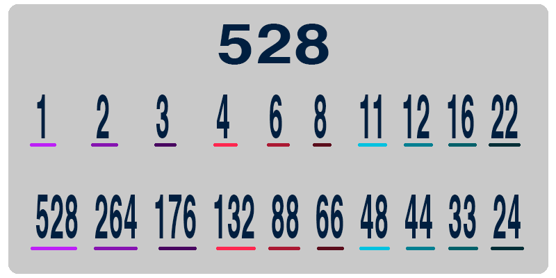

# Как быстро найти делители натурального числа без остатка

Нахождения делителей натурального числа без остатка является распространенной задачей для тех кто изучает программирование. На различных форумах можно увидеть темы о том как реализовать этот алгоритм на таких языках как C, C++ или C#. Вот пример данного алгоритма.

```c
#include <iostream>
using namespace std;
 
int main()
{
  int n,i;
  cout << "Введите число N" << endl;
  cin >> n;
  for( i = n; i > 0; i-- )
  {
    if( n % i == 0 )
    {
      cout << "Делитель: " << i << endl;
    }
  }
  system("pause");
  return 0;
}
```

Не смотря на то что задача является простой, данная реализация является неудачной 😟. Объясняю почему.

Допустим нужно определить все делители без остатка для числа 528. Его делители являются числа: 1, 2, 3, 4, 6, 8, 11, 12, 16, 22, 24, 33, 44, 48, 66, 88, 132, 176, 264 и 528. Для того что бы определить эти числа нужно проделать 528 итераций в цикле. Принимая во внимание факт того, что после числа 528 ближайшим делителем является число 264 — половина итераций идут впустую. Остается вторая половина итерация от 264 до 1, но и тут большая часть итераций идет впустую. Из 264 возможных варианта подходят только 19 — это: 264, 176, 132, 88, 66, 48, 44, 33, 24, 22, 16, 12, 11, 8, 6, 4, 3, 2, 1.

К удивлению, наши 20 «правильных» итераций, которые дают 20 чисел для ответа, можно сократить наполовину. Принимая во внимание то, что время деления делитель и частное дополняют друг друга. Как только нашли делитель без остатка, частное этого выражения тоже является делителем без остатка:

* 528 делится на 528, получается 1,
* 528 делится на 264, получается 2,
* 528 делится на 176, получается 3,
* и так далее



Как же быть?

Можно оптимизировать текущий код добавив в него условия, но что бы этого не делать на помощь приходит факторизация!

[Подробная статья про факторизацию]([/images/logo.png](https://ru.wikipedia.org/wiki/%D0%A4%D0%B0%D0%BA%D1%82%D0%BE%D1%80%D0%B8%D0%B7%D0%B0%D1%86%D0%B8%D1%8F_%D1%86%D0%B5%D0%BB%D1%8B%D1%85_%D1%87%D0%B8%D1%81%D0%B5%D0%BB))

Путем не хитрых манипуляций получаем следующие функции что бы протестировать выигрыш от нового решения. Функция divisor находит делители числа без остатка при помощи перебора. А функция divisor_by_factorization находит делители числа без остатка при помощи факторизации.

```ruby
require 'prime'

def divisor(number)
  answer = []
  i = number
  while i > 0
    if number % i == 0
      answer.push( i )
    end
    i -= 1
  end
  answer
end

def divisor_by_factorization(number)  
  primes, powers = number.prime_division.transpose
  exponents = powers.map{|i| (0..i).to_a}
  divisors = exponents.shift.product(*exponents).map do |powers|
    primes.zip(powers).map{|prime, power| prime ** power}.inject(:*)
  end
  divisors.sort
end


begin_time = Time.now
  for num in 10..25000
    divisor( num )
  end
puts Time.now - begin_time

begin_time = Time.now
  for num in 10..25000
    divisor_by_factorization( num )
  end
puts Time.now - begin_time

#18
#0.9
```

Теперь протестируем наши функции на данных. Путь оба алгоритма вычислят делители без остатка на ряде чисел от 10 до 25 000.

Итоги получаются следующие. Для метода перебора потребовалось 18 секунд. А при помощи факторизации, выполнение алгоритма заняло всего 0.9 секунд. Это в 20 раз эффективнее чем обычным перебором.

[Medium](https://kopilov-vlad.medium.com/%D0%BA%D0%B0%D0%BA-%D0%B1%D1%8B%D1%81%D1%82%D1%80%D0%BE-%D0%BD%D0%B0%D0%B9%D1%82%D0%B8-%D0%B4%D0%B5%D0%BB%D0%B8%D1%82%D0%B5%D0%BB%D0%B8-%D0%BD%D0%B0%D1%82%D1%83%D1%80%D0%B0%D0%BB%D1%8C%D0%BD%D0%BE%D0%B3%D0%BE-%D1%87%D0%B8%D1%81%D0%BB%D0%B0-%D0%B1%D0%B5%D0%B7-%D0%BE%D1%81%D1%82%D0%B0%D1%82%D0%BA%D0%B0-2750307f47a3)
