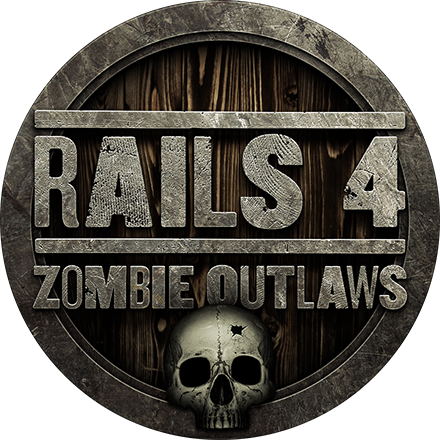

# Review ruby path on Codeschool

Hi everyone. Recently I completed Ruby path on Codeschool. And now I want to write review about it.


First, what is Codeschool? Codeschool is online learning platform for improve programming skills. Codeschool has many courses, each course contain few levels with video and interactive exercises. Badges, interactive courses with beautiful design — in Codeschool you learn like play a game.

[For more information, you can see this video](https://www.youtube.com/watch?v=MvyG_ODng3w)


All courses combined into paths. Ruby path has 10 courses joined in sections:

* Getting started with Ruby on Rails — contains 3 courses for introduction Ruby and Rails. It contains Try Ruby, Rails for Zombie Redux and Rails for Zombie 2.
* Ruby language — contains 2 courses for learn basic things on ruby. It contains Ruby bits and Ruby bits Part 2.
* Intermediate Ruby on Rails — contains 3 courses that teach you how to organizing code, writing API and show you the best practice on Rails. It contains Rails 4: Zombie Outlaws, Surviving APIs with Rails, Rails 4 Patterns.
* Rails test — contains 2 courses for testing your Rails apps. It contains Rails Testing for Zombie, Testing with RSpec.

Let’s talk more about each course.

## Try Ruby


It’s free small course for beginner in programing. In this course you will get an introduction to data types (numbers, stings, arrays and hashes), functions and methods. You will learn how to do simple manipulation with data.

## Rails for Zombies Redux


It’s free course for beginner in Rails. If you never heard about Rails, learn this course. In this course you will know

* what is MVC
* how to manipulate data
* what is CRUD
* what is routing

This course is very interesting if you don’t know anything about Rails. But remember, it’s introduction to Rails. Information in this course is not enough for writing own Rails app.

## Rails for Zombies 2


It’s real useful course about Rails. In it you will learn more about Rails. This course is large, and it take approximately 6–8 hours, but it’s really useful time.

This course will give you answers on questions:

* how to install Rails and create Rails app
* how to use Rails commands
* what is migration and how to use it
* how to set relationship options
* and what is REST

You will learn more about use MVC, and data manipulating. I recommend to try it after Rails for Zombie Redux.

## Ruby bits and Ruby bits part 2


These courses are useful for understanding ruby language. In these courses you will learn more about:

* language syntax and structure
* how to make the code shorter
* how to use classes
* how to write and use modules
* what is blocks, lambdas and how to use it
* how to create DLS
* best code practices

I recommend these courses for everyone who started learn ruby.

## Rails 4: zombie outlaws



It’s one of intermediate Rails courses. This course about Rails 4 best practices. The course is very useful and will teach you new features like:

* new matches for routes and how to fix duplications in routes
* new methods for find data in models and routers
* flash types and json handler
* memcache and caching

## Surviving APIs with Rails


It’s very good intermediate course about how to write API on Rails. If you need to write API for some service or you need to know how to do your API cleaner and better, this course special for you. In this course you will learn:

* how to keep API under its own subdomain
* how to using namespaces to keep controllers organized
* how to write good integration tests for API
* how to organize API versioning controller
* how to organize authentication for access to protected resources

## Rails 4 patterns


This course teach you to use useful patterns in Rails applications for cleaner and maintenable code. You will learn that fat controllers are bad because it’s hard to understand and new features hard to implement. You will learn how to create abstract models for remove duplication and create decorations for models to remove view logic.

Very useful lesson is FineTuning that teach you how create faster queries. When you don’t need ActiveRecords object, but need only id, name or other resources, use pluck method and be happy.

## Rails Testing for Zombie


Great big course for testing Rails app. Everyone who want to learn how to test Rails app need complete this course. Course has many useful tools:

* unit testing
* model testing
* loading test data with fixtures
* easy testing with shoulda gem
* using stub and mock with mocha gem
* integration testing
* integration testing with capybara gem
* using factories with factory girl gem

It’s really good and useful course I recommend for everyone.

## Testing with RSpec


This course dedicated to RSpec, popular tool for testing Rails app. This course teaches RSpec 2.10 version, but now RSpec has 3.4 version. This course use deprecated methods therefore if you don’t need see Deprecation Warnings when you running test, you need use modern methods. For example:

```ruby
# 2.10 version
zombie.name.should == "Ash"

# modern version
expect(zombie.name).to eq("Ash")
```

But the course is good and I waiting for remake with modern version RSpec.

And some words in the end. I really like Codeschool. They courses are not boring, information are interesting. Codeschool has many other courses combined into paths: Javascript path, HTML/CSS path, Python path, iOS path, Git path, Database path and Electives path. In addition courses there are good screencasts and shows. I recommend it for everyone who learning programming.

[all images are from codeschool.com](codeschool.com)

[Medium](https://kopilov-vlad.medium.com/review-ruby-path-on-codeschool-54e603ee468d)
