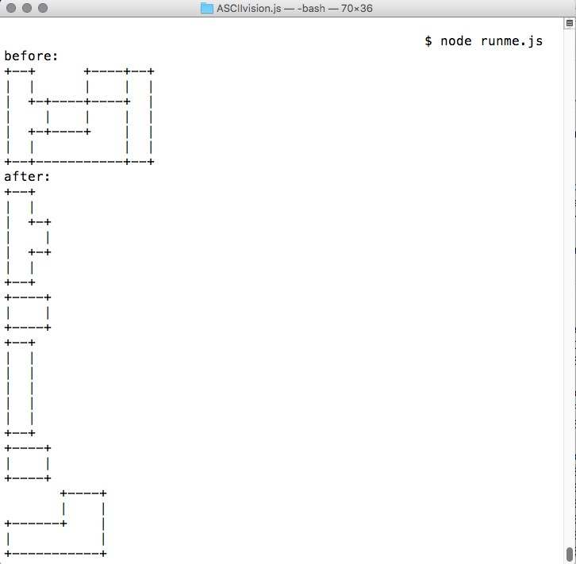

# Algorithmic vision of the ASCII shapes

Recently, I solved a task of identifying rectangular two-dimensional shapes in ASCII diagram. The task was difficult and interesting, it look like simple computer vision. I have written an algorithm to solve it and I want to write more about it.

The script takes ASCII diagram in an array and returns an array with separate shapes, like this:

```ruby
# shape
 [“+--------------+”,
  “|              |”,
  “|              |”,
  “|              |”,
  “+-------+------+”,
  “|       |      |”,
  “|       |      |”,
  “+-------+------+”]

# correct_answer
 [[“+-----------+”,
   “|           |”,
   “|           |”,
   “|           |”,
   “+-----------+”],
  [“+-------+”,
   “|       |”,
   “|       |”,
   “+-------+”],
  [“+------+”,
   “|      |”,
   “|      |”,
   “+------+”],
 ]
```

And the script can identify different shapes like this:

```ruby
# shape 
  [ "+--+      +----+--+",
    "|  |      |    |  |",
    "|  +-+----+----+  |",
    "|    |    |    |  |",
    "|  +-+----+    |  |",
    "|  |           |  |",
    "+--+-----------+--+"]

# correct answer
  [
   ['+--+  ',
    '|  |  ',
    '|  +-+',
    '|    |',
    '|  +-+',
    '|  |  ',
    '+--+  '],
   ['+----+',
    '|    |',
    '+----+'],
   
   ['+--+',
    '|  |',
    '|  |',
    '|  |',
    '|  |',
    '|  |',
    '+--+'],
   
   ['+----+',
    '|    |',
    '+----+'],
   
   ['       +----+',
    '       |    |',
    '+------+    |',
    '|           |',
    '+-----------+']
  ]

# it looks like tetris 😀
```

There are few rules for ASCII diagram:

* Diagram can contain only ‘+’, ‘-‘, ‘|‘ and space,
* Shapes can’t be nested.

How to do it?

* First, need to formulate the algorithm.
* Second, need to program it.

My algorithm works as follows:

* Step 1: Find nearest ‘+’ in upper left corner in ASCII diagram.
* Step 2: Collect a shape moving clockwise. Save it in an array.
* Step 3: Remove collected shape from ASCII diagram.
* Step 4: Remove whitespace from all sides in ASCII diagram.
* Step 5: If ASCII diagram is not empty and contain ‘+’ go to step 1.
* Step 6: Return an array with collected shapes.

I programmed it with javascript. You can see source in github. And you can clone and use it. [Link to github](https://github.com/kopylovvlad/ASCIIvision.js).



But what is next?

My solution is very good, but script can be improved. For example, script should work with triangle and other not-rectangular figures. Like this:

```ruby
# shape
 ["*-----*",
  "|\   /|",
  "| \ / |",
  "|  *  |",
  "| / \ |",
  "|/   \|",
  "*-----*"]

# correct answer
  [
   ["*-----*",
    " \   / ",
    "  \ /  ",
    "   *   "],
   ["*   ",
    "|\  ",
    "| \ ",
    "|  *",
    "| / ",
    "|/  ",
    "*   "],
   ["   *",
    "  /|",
    " / |",
    "*  |",
    " \ |",
    "  \|",
    "   *"],
   ["   *   ",
    "  / \  ",
    " /   \ ",
    "*-----*"]
  ]
```

It will be very good, maybe I should improve it in future. Or someone can realize it and push code to repository.

[Medium](https://kopilov-vlad.medium.com/algorithmic-vision-of-the-ascii-shapes-7cc5c4b017ee)
