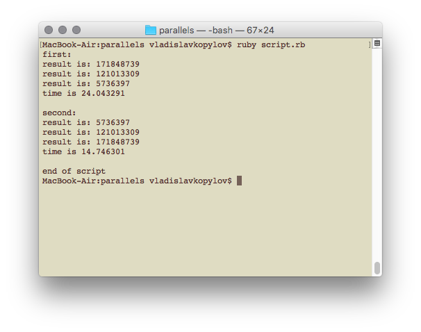

# Parallel processing with ruby

If you want to optimise your code with parallel processing in ruby you can use very useful gem Parallel.

[parallel](https://github.com/grosser/parallel)

Gem Parallel can use all your CPUs for any calculation ( math/map-reduce processing) or downloads/uploads.

Let’s test it. We want to calculate sum of prime number in array of any numbers.

In other word, we have array [1,2,3,4,5]. We need to find prime numbers ([1,2,3,5]). And then need to calculate sum (11). Array of numbers from 1 to 5 is very small to feel differents. I will use three arrays in a row with numbers from 1 to 60000, 50000 or 10000.

You can see code below. I know that is_prime? function is not optimised and better to user prime library for it. But for example I use it.

```ruby
#script to see differents between consistently calculation and parallel calculation
gem "parallel"
require 'parallel'


#function can compute more efficiently and I know it :)
def is_prime?(num)
  return true if num == 1
  return false if num < 1
  for x in 2...num
    return false if num % x == 0
  end
  true
end

def get_sum_of_prime_numbers( array )
  array
    .select{|num| is_prime? num }
    .reduce(:+)
end

def exec_time(proc)
  begin_time = Time.now
  proc.call
  Time.now - begin_time
end

calculate = proc do |array| 
  res = get_sum_of_prime_numbers(array)
  puts "result is: #{res}"
end


#procs
first_proc = proc do 
  arrays = [ Array(1...60000), Array(1...50000), Array(1...10000) ]
  
  arrays.map do |array|
    calculate.call array
  end
end

second_proc = proc do 
  arrays = [ Array(1...60000), Array(1...50000), Array(1...10000) ]
  
  Parallel.map(arrays, in_processes: 3) { |array|
    calculate.call array
  }
end


#calculations
puts "first: "
time = exec_time( first_proc )
puts "time is #{time}\n\r"

puts "second: "
time = exec_time( second_proc )
puts "time is #{time}\n\r"

puts "end of script"
```

If we run this code in console, we will see results:



Pretty cute, yeah?

[Medium](https://kopilov-vlad.medium.com/parallel-processing-with-ruby-9ba6352028a0)
