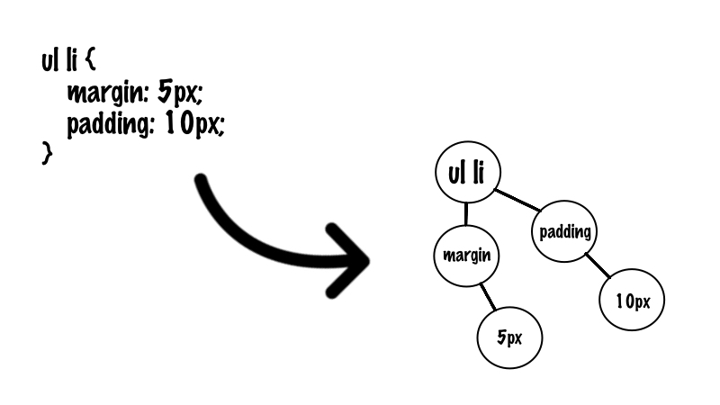

# Пишем свой собственный компилятор или заново изобретаем SASS


Профессия разработчика прекрасна не только тем что ей можно обучиться самому проходя онлайн-курсы или читая книги. Но и получить небольшой опыт самостоятельно: написать свой аналог (или доработку) существующей библиотеки или продукта "just for fun" и залит его на github.

Лично я убежден, что каждый разработчик должен потратить личное время чтобы написать свою CMS, интерпретатор/компилятор или свою js-библиотеку для создания интерактивных интерфейсов 😎. Это очень хорошая самостоятельная практика языка и доведения проекта до конца.

Свою CMS я писал дважды, так что пришло время написать компилятор.

## Зачем нужно писать компилятор/интерпретатор?

Каждый из этих инструментов решает свою специфичную задачу.

Компилятор выполняет задачу преобразования одного языка в другой без потери смысла. Это необходимо когда среда, в которой пишется код и то где он будет выполняться — разная.

Более конкретный пример: Современные браузеры понимают только язык javascript, но это не повод писать на нем клиентскую часть. Есть много языков которые [компилируются в него](https://github.com/jashkenas/coffeescript/wiki/list-of-languages-that-compile-to-js).

Интерпретатор выполняет задачу обработки и мгновенного выполнения исходной программы или запроса, без компиляции его в другой язык. Есть много интерпретируемых языков программирования, таких как Ruby, Python, Javascript и др.

Более конкретный, рабочий пример: Отдел маркетинга каждый день посылает запрос IT-отделу на выгрузку данных из БД в csv-файлы. При этом форматы метрик, по которым надо сделать выгрузку, могут часто меняться. Чтобы не продолжать нагружать программистов каждодневным переписыванием кода, можно реализовать интерпретатор, который будет представлять собой ограниченную версию SQL и будет более понятен типичному сотруднику. Благодаря этому отдел маркетинга получает возможность делать выгрузки самостоятельно и быстро.

## Пишем свой компилятор

Перед тем как начать писать, нужно было определиться с функционалом.

При выборе функционала компилятора стояли следующие требования:

* Он не должен быть слишком простой, чтобы его было скучно делать
* Он не должен быть сложным, чтобы тратить на него все свободное время

Идеи о создании компилятора языка программирования отошли на второй план. Был выбор между написанием аналога препроцессинга SASS или шаблонизатора HAML/SLIM. В итоге был выбран SASS.

Осталось определиться с функционалом. Я поставил цель реализовать следующие фичи:

* Использование многострочных комментариев
* Использование переменных
* Использование миксинов
* Вложенность селекторов

Но и появился ряд ограничений:

* Переменные и миксины не могут быть вложенные
* Миксины не имеют входящих аргументов

## Структура приложения

Само приложение представляет собой механизм компиляции (machine) и CLI (консольный интерфейс).

Консольный интерфейс — это стандартный bin-файл. А механизм компиляции состоит из трех частей:

* Парсер — здесь логика преобразования текста в абстрактное синтаксическое дерево (AST).
* Трансформатор — здесь логика преобразования вложенного синтаксического дерева в не вложенную структуру.
* Компилятор — здесь логика компиляции (отрисовки) синтаксического дерева в файл.

## Парсер



Это часть системы, которая преобразует исходный текст в абстрактное синтаксическое дерево. Это дерево отражает смысловую и синтаксическую структуру исходного текста для дальнейшей обработки.

Иными словами: нужен инструмент который способен преобразовать сплошной текст в набор коротких, последовательный и вложенных процедур. Относительно которых можно легко описать правила взаимодействия машины с ними. Парсер выполняет задачу: "преобразуй этот текст в набор инструкций которыми будет удобно манипулировать машине".

Более подробно про его работу:

И так, у нас есть файлик с css, который надо преобразовать.

```css
/* example 1 */
nav ul, nav ol {
    margin: 0;
    padding: 0px;
    list-style: none;
    font: 12pt/10pt sans-serif;
}
```

Парсер проходит по тексту, удаляет комментарии, разбивает текст на минимальные логические части. В данном случае, для разделения текста на минимальные логические части, достаточно разбить текст относительно символов ‘;’, ‘{‘, ‘}’. В итоге, текст преобразовывается в массив строк.

```ruby
[
  'nav ul, nav ol {',
  'margin: 0;',
  'padding: 0px;',
  'list-style: none;',
  'font: 12pt/10pt sans-serif;',
  '}'
]
```

После этого парсер проходит по каждой логической части и оборачивает его в абстрактный узел. Это дает нам набор последовательных процедур. Массив строк преобразовался в массив объектов, которыми можно манипулировать, но объекты пока не являются вложенными.

```ruby
[
  #<SelectorStartParserNode @name="selector start", @value="nav ul, nav ol {">, 
  #<PropertyParserNode @name="property", @value="margin: 0;">, 
  #<PropertyParserNode @name="property", @value="padding: 0px;">, 
  #<PropertyParserNode @name="property", @value="list-style: none;">, 
  #<PropertyParserNode @name="property", @value="font: 12pt/10pt sans-serif;">, 
  #<SelectorEndParserNode @name="selector end", @value="}">
]
```

После этого парсер преобразует предыдущий массив в абстрактное синтаксическое дерево (AST). У нас появилась вложенная структура, которой легко манипулировать для дальнейшей обработки.

```ruby
[
  #<SelectorAstNode
    @class_name="Selector.new”, 
    @name="nav ul, nav ol”, 
    @children=[
      #<PropertyAstNode 
        @class_name="Property.new", 
        @name="margin", 
        @children=[], 
        @value= #<AstNodeValue 
          @class_name="VirtualString.new", 
          @value="0">>, 
      #<PropertyAstNode 
        @class_name="Property.new", 
        @name="padding", 
        @children=[], 
        @value= #<AstNodeValue 
          @class_name="VirtualString.new", 
          @value="0px">>, 
      #<PropertyAstNode 
        @class_name="Property.new", 
        @name="list-style", 
        @children=[], 
        @value= #<AstNodeValue 
          @class_name="VirtualString.new", 
          @value="none">>, 
      #<PropertyAstNode 
        @class_name="Property.new", 
        @name="font", 
        @children=[], 
        @value= #<AstNodeValue:0x007fa5b9046760 
          @class_name="VirtualString.new", 
          @value="12pt/10pt sans-serif">>
    ], 
    @value= #<AstNodeValue 
      @class_name="", 
      @value="">>
]
```

Вот пример работы для более сложной структуры.

До (scss файл):

```scss
/* example 2 */
$other-color: red;
$main_color: green;
@mixin border-radius {
  -webkit-border-radius: 10px;
     -moz-border-radius: 10px;
      -ms-border-radius: 10px;
          border-radius: 10px;
}
div {
  color: $main_color;
  @include border-radius;
}
p {
  color: blue;
  border-radius: 5px;
  border-color: $other-color;
}
```

После (AST):

```ruby
[
  #<VarAssignAstNode 
    @class_name="VariableAssign.new", 
    @name="other-color", 
    @children=[], 
    @value= #<AstNodeValue @class_name="VirtualString.new", @value="red">>, 
  #<VarAssignAstNode 
    @class_name="VariableAssign.new", 
    @name="main_color", 
    @children=[], 
    @value= #<AstNodeValue @class_name="VirtualString.new", @value="green">>, 
  #<MixAssignAstNode 
    @class_name="MixinAssign.new", 
    @name="border-radius", 
    @children=[
      #<PropertyAstNode 
        @class_name="Property.new", 
        @name="-webkit-border-radius", 
        @children=[], 
        @value= #<AstNodeValue @class_name="VirtualString.new", @value="10px">>, 
      #<PropertyAstNode 
        @class_name="Property.new", 
        @name="-moz-border-radius", 
        @children=[], 
        @value= #<AstNodeValue @class_name="VirtualString.new", @value="10px">>, 
      #<PropertyAstNode 
        @class_name="Property.new",
        @name="-ms-border-radius", 
        @children=[], 
        @value= #<AstNodeValue @class_name="VirtualString.new", @value="10px">>, 
      #<PropertyAstNode 
        @class_name="Property.new", 
        @name="border-radius", 
        @children=[], 
        @value= #<AstNodeValue @class_name="VirtualString.new", @value="10px">>
    ], 
    @value= #<AstNodeValue @class_name="", @value="">>, 
  #<SelectorAstNode 
    @class_name="Selector.new", 
    @name="div", 
    @children=[
      #<PropertyAstNode 
        @class_name="Property.new", 
        @name="color", 
        @children=[], 
        @value= #<AstNodeValue @class_name="Variable.new", @value="main_color">>, 
      #<MixinAstNode 
        @class_name="Mixin.new",
        @name="border-radius", 
        @children=[], 
        @value= #<AstNodeValue @class_name="", @value="">>
    ], 
    @value= #<AstNodeValue @class_name="", @value="">>, 
  #<SelectorAstNode 
    @class_name="Selector.new", 
    @name="p", 
    @children=[
      #<PropertyAstNode 
        @class_name="Property.new", 
        @name="color", 
        @children=[], 
        @value= #<AstNodeValue @class_name="VirtualString.new", @value="blue">>, 
      #<PropertyAstNode 
        @class_name="Property.new", 
        @name="border-radius", 
        @children=[], 
        @value= #<AstNodeValue @class_name="VirtualString.new", @value="5px">>, 
      #<PropertyAstNode 
        @class_name="Property.new", 
        @name="border-color", 
        @children=[], 
        @value= #<AstNodeValue @class_name="Variable.new", @value="other-color">>
    ], 
    @value= #<AstNodeValue @class_name="", @value="">>
]
```

## Трансформатор


Это часть системы которая преобразует синтаксическое дерево абстрактных узлов, в набор процедур. Именно они будут понятны компилятору для запуска отрисовки. Плюс, в нем находится логика преобразования вложенных селекторов в не вложенную структуру, так как CSS не поддерживает вложенные селекторы.

Иными словами: Трансформатор выполняет задачи:

* Пройдись по дереву и если увидишь где-то вложенность, то преобразуй ее в не вложенную структуру.
* Пройдись по дереву и преобразуй каждый абстрактный узел в конкретную процедуру которую сможет отрисовать компилятор.

Файл с таким содержимым:

```css
/* example 1 */
nav ul, nav ol {
    margin: 0;
    padding: 0px;
    list-style: none;
    font: 12pt/10pt sans-serif;
}
```

После прохождения парсера и трансформатора предоставит следующую структуру:

```ruby
[
  #<Selector 
    @name="nav ul, nav ol", 
    @declaration=[
      #<Property 
        @name="margin", 
        @value= #<VirtualString @value="0">>, 
      #<Property 
        @name="padding", 
        @value= #<VirtualString @value="0px">>, 
      #<Property 
        @name="list-style", 
        @value= #<VirtualString @value="none">>, 
      #<Property 
        @name="font", 
        @value= #<VirtualString @value="12pt/10pt sans-serif">>
    ]>
]
```

Более сложный пример.

До:

```scss
$other-color: red;
$main_color: green;
div {
  color: $main_color;
  p {
    color: $main_color;

    span {
      font-size: 9px;
    }
  }
}
p {
  color: blue;
}
```

После:

```ruby
[
  #<VariableAssign 
    @name=:"other-color", 
    @expression= #<VirtualString @value="red">>, 
  #<VariableAssign 
    @name=:main_color, 
    @expression= #<VirtualString @value="green">>, 
  #<Selector 
    @name="div", 
    @declaration=[
      #<Property 
        @name="color", 
        @value= #<Variable @name=:main_color>>
    ]>, 
  #<Selector 
    @name="div p", 
    @declaration=[
      #<Property 
        @name="color", 
        @value= #<Variable @name=:main_color>>
    ]>, 
  #<Selector 
    @name="div p span", 
    @declaration=[
      #<Property 
        @name="font-size", 
        @value= #<VirtualString @value="9px">>
    ]>, 
  #<Selector 
    @name="p", 
    @declaration=[
      #<Property 
        @name="color", 
        @value= #<VirtualString @value="blue">>
    ]>
]
```

## Компилятор

Это часть системы, которая проходит по абстрактному синтаксическому дереву и на основе его структуры отрисовывает css-файл.

Обход дерева проходит в два этапа:

Первый: обойди все дерево и преобразуй узлы которые подвержены преобразованиям. Преобразования могут быть следующие:

* Значения переменных сохраняются во временное хранилище.
* В значениях свойств в которых используются переменные, подставляются значения из хранилища.
* Свойства миксинов тоже сохраняются во временное хранилище.
* В селекторы, внутри которых используются миксины, подставляются значения нужных свойств из хранилища.

Второй: запускается обход преобразованного дерева и происходит отрисовка тех узлов которые нужно отрисовать (только селекторы и их свойства).

После всех этих нехитрых манипуляций, мы получаем валидный css-файл.

## Заключение

Конечно, данный функционал недотягивает до настоящего [SASS](https://github.com/sass/sass) и данная реализации менее стабильная в работе. Но данный опыт был интересным, небольшой персональный челлендж на проверку собственных сил. Особенно забавно не просто реализовывать сложный функционал, а делать это в соответствии со стайл-гайдами, благо есть такие инструменты как [rubocop](https://github.com/bbatsov/rubocop) и [rubycritic](https://github.com/whitesmith/rubycritic).

Весь исходный код выложен на github. Пример использования можно прочесть в README в разделе "Example of usage". Исходные файлы хранятся в папке /source, скомпилированные файлы сохраняются в папку /css. [https://github.com/kopylovvlad/lite_scss](https://github.com/kopylovvlad/lite_scss)

Спасибо за время потраченное на прочтение данной статьи. "Knowledge must be shared"

[Medium](https://kopilov-vlad.medium.com/%D0%BF%D0%B8%D1%88%D0%B5%D0%BC-%D1%81%D0%B2%D0%BE%D0%B9-%D1%81%D0%BE%D0%B1%D1%81%D1%82%D0%B2%D0%B5%D0%BD%D0%BD%D1%8B%D0%B9-%D0%BA%D0%BE%D0%BC%D0%BF%D0%B8%D0%BB%D1%8F%D1%82%D0%BE%D1%80-%D0%B8%D0%BB%D0%B8-%D0%B7%D0%B0%D0%BD%D0%BE%D0%B2%D0%BE-%D0%B8%D0%B7%D0%BE%D0%B1%D1%80%D0%B5%D1%82%D0%B0%D0%B5%D0%BC-sass-225e39d31d82)
