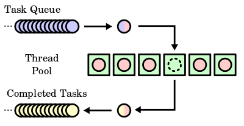

# Working with Thread in Ruby


Thread is the Ruby implementation for a concurrent programming model. Threads are useful for operations: sending or processing HTTP-requests; manipulations with database; I/O operations.

Typical thread example: write code for sending several URL requests. You have an array of URLs, and you should send a request for every URL and calculate response size. Without threads, the code will be like this.

```ruby
require 'open-uri'
urls = [
  'https://www.google.com/',
  'https://www.youtube.com/',
  'http://www.rubyflow.com',
  'https://rubyonrails.org/'
]
urls.each do |url|
  resp = open(url)
  puts "#{url} has content length #{resp.read.size} symbols"
end
```

If you have more than 200–300 URLs, the code will be performed too long. Let’s rewrite code with threads for reducing performing time. The code with threads will be faster because it will be executed in parallel.

```ruby
require 'open-uri'

urls = [
  'https://www.google.com/',
  'https://www.youtube.com/',
  'http://www.rubyflow.com',
  'https://rubyonrails.org/'
]
# threads array
threads = []

urls.each do |url|
  threads << Thread.new(url) do |i|
    resp = open(i)
    puts "#{i} has content length #{resp.read.size} symbols"
  end
end

# run all threads
threads.each { |thr| thr.join }
```

Another typical example is writing TCP server. You can quickly implement it with TCPServer class and infinity loop, but every request will be processed in a sequence.

```ruby
require 'socket'

# run on localhost:3000
server = TCPServer.new('localhost', 3000)

loop do
  socket = server.accept
  request = socket.gets
  method, path = request.split
  sleep_time = rand(5)

  # some calculation is here
  sleep(sleep_time)

  response = "Hello World!\n" +
             "your request: #{request}" +
             "method: #{method.inspect}\n" +
             "path: #{path.inspect}\n" +
             "sleep time: #{sleep_time}\n"

  socket.print "HTTP/1.1 200 OK\r\n" +
               "Content-Type: text/plain\r\n" +
               "Connection: close\r\n" +
               "Content-Length: #{response.bytesize}\r\n"

  socket.print "\r\n"
  socket.print response

  socket.close
end
```

If you want to process requests in parallel, you should use threads. This is simple implementation with multi-threading. You just replace `socket=server.accept` by `Thread.start(server.accept) do |socket|`.

```ruby
require 'socket'

# run on localhost:3000
server = TCPServer.new('localhost', 3000)

loop do
  Thread.start(server.accept) do |socket|
    request = socket.gets
    method, path = request.split
    sleep_time = rand(5)

    # fake calculation is here
    sleep(sleep_time)

    response = "Hello World!\n" +
              "your request: #{request}" +
              "method: #{method.inspect}\n" +
              "path: #{path.inspect}\n" +
              "sleep time: #{sleep_time}\n"

    socket.print "HTTP/1.1 200 OK\r\n" +
                "Content-Type: text/plain\r\n" +
                "Connection: close\r\n" +
                "Content-Length: #{response.bytesize}\r\n"

    socket.print "\r\n"
    socket.print response

    socket.close
  end
end
```

## Thread-pool

How to manage multi-threading? For example, you want to run only 2, 5 or 10 threads. If you’re going to do it, use Thread-pool pattern. It can help you set thread-limit.



Here is the implementation of Thread-pool. Thread-pool has a queue of tasks and threads array. Each thread takes one task from queue, does jobs and takes another task from the queue.

```ruby
# thread pool class
class ThreadPool
  def initialize(size)
    @size = size
    @jobs = Queue.new
    @pool = Array.new(@size) do |i|
      Thread.new do
        Thread.current[:id] = i
        catch(:exit) do
          loop do
            job, args = @jobs.pop
            job.call(*args)
          end
        end
      end
    end
  end

  # add a job to queue
  def schedule(*args, &block)
    @jobs << [block, args]
  end

  # run threads and perform jobs from queue
  def run!
    @size.times do
      schedule { throw :exit }
    end
    @pool.map(&:join)
  end
end


# an instance of ThreadPool with 5 threads
pool = ThreadPool.new(5)


# add 20 tasks to query
20.times do |i|
  pool.schedule do
    sleep_time = rand(4) + 2
    sleep(sleep_time)
    puts "Job #{i} with sleep time #{sleep_time}, finished by thread #{Thread.current[:id]}"
  end
end

# run all threads
pool.run!
```

When will Thread-pool be useful? It is helpful for processing bunch operations from an array or a queue. For example, you calculate math operations with I/O: calculating SHA256 of various string to find the result with X amount of leading 0’s. You were given a string `hello world!<number>`. You should replace <number> with a number to result SHA256 must be with 1 leading 0's.

More visually:

```
SHA256 of ‘hello world!1’ is 8053f81c65ba639c6aa54118f111d9cbe275bf410bb6a4b2ec70a03f9629ffc0

SHA256 of ‘hello world!2’ is 79d11adb260a7fec1e6ac6deb88445a83eaed84a7e05f1a82adcaa8ee4610d27

SHA256 of ‘hello world!3’ is 7b0c15fca0538de4202a7db1c9c1690ca377099fc93d6915a2e2ad11a4c55e0c

...

SHA256 of ‘hello world!9’ is 0fe33fac0dc830c7d9004cb1c9e2d2940fabcd21828a6f68a38653a3dd3b8b4c
```

WOW! SHA256 of `hello world!9` is the string with 1 leading 0’s. Let’s write code for finding string with 3 leading 0's.

For masOS, I am using [sha2 CLI-tool](http://brewformulas.org/Sha2). For Linux, you can use [sha256sum](http://man7.org/linux/man-pages/man1/sha256sum.1.html). Each executing CLI-tool is I/O operation and we can reduce performing time by using threads.

```ruby
require 'time'

module HashGenerator
  # calculating hash for string "#{string}#{number}"
  def self.call(string, number)
    # for macOS
    return `echo '#{string}#{number}' | sha2 -256`
      .gsub('SHA-256 ((null)) = ', '')
      .gsub(/\n/, '')
    # for Linux
    # return `echo '#{string}#{number}' | sha256sum`.gsub(/\s\s\-$/, '')
  end
end

module HashChecker
  # check does the hash is started with corrent numbers
  def self.call(hash_str, zero_count)
    hash_start = hash_str[0..(zero_count - 1)]
    hash_start == ('0' * zero_count)
  end
end

module TimeSplitter
  # prepare time format for output
  def self.call(time_start, time_end)
    seconds = ((time_end - time_start)).round
    minutes = ((time_end - time_start) / 60).round
    [minutes, seconds]
  end
end

# class for calculcation
# it takes main string and number of leading zeros
class MainMachine
  attr_reader :main_string, :zero_count

  def initialize(main_string, zero_count)
    @main_string = main_string
    @zero_count = zero_count
  end

  def perform
    time_start = Time.now
    number = 0
    sha_hash = ''

    # infinity loop
    loop do
      # generate hash
      sha_hash = HashGenerator.call(main_string, number)

      # check is hash valid
      if HashChecker.call(sha_hash, zero_count) == true
        # break loop if hash is valid
        break
      end

      # increase number for another iteration
      number += 1
    end

    # output
    time_end = Time.now
    minutes, seconds = TimeSplitter.call(time_start, time_end)
    puts "\n\rstring: '#{main_string}'"
    puts "number: '#{number}'"
    puts "hash: '#{sha_hash}'"
    puts "time: '#{minutes}'(minutes), '#{seconds}'(seconds)"
  end
end

main_string = 'hello world!'
number_of_leading_zeros = 3
MainMachine.new(main_string, number_of_leading_zeros).perform
```

And result is:

```
string: 'hello world!'
number: '3727'
hash: '000112a685cacf5d0a99fde15a9116796244d4550cb945f0193404c428048414'
time: '1'(minutes), '37'(seconds)
```

Let’s solve the task by Thread-pool. It will be performing faster.

```ruby
require 'time'

# thread pool class
# it takes pool size
class ThreadPool
  attr_reader :result, :number, :size

  def initialize(size)
    @finish = false
    @result = nil
    @number = nil
    @size = size
    @jobs = Queue.new
    @pool = init_pool
  end

  def finish?
    @finish
  end

  def finish!(result, number)
    @finish = true
    @result = result
    @number = number
    @jobs = [[ Proc.new {}, nil]]
  end

  def jobs_size
    @jobs.size
  end

  # add a job to queue
  def schedule(*args, &block)
    @jobs << [block, args]
  end

  def clear!
    @jobs = []
  end

  # run threads and perform jobs from queue
  def run!
    @size.times do
      schedule { throw :exit }
    end
    @pool.map(&:join)
  end

  private

  def init_pool
    Array.new(size) do
      Thread.new do
        catch(:exit) do
          loop do
            job, args = @jobs.pop
            job.call(*args)
            break if @jobs.size == 0
          end
        end
      end
    end
  end
end

module HashGenerator
  # calculating hash for string "#{string}#{number}"
  def self.call(string, number)
    # for macOS
    return `echo '#{string}#{number}' | sha2 -256`
      .gsub('SHA-256 ((null)) = ', '')
      .gsub(/\n/, '')
    # for Linux
    # return `echo '#{string}#{number}' | sha256sum`.gsub(/\s\s\-$/, '')
  end
end

module HashChecker
  # check does hash start with corrent numbers
  def self.call(hash_str, zero_count)
    hash_start = hash_str[0..(zero_count - 1)]
    hash_start == ('0' * zero_count)
  end
end

module TimeSplitter
  # prepare time format for output
  def self.call(time_start, time_end)
    seconds = ((time_end - time_start)).round
    minutes = ((time_end - time_start) / 60).round
    [minutes, seconds]
  end
end


class MainMachine
  attr_reader :main_string, :zero_count, :thread_count, :query_limit

  def initialize(main_string, zero_count, thread_count)
    @main_string = main_string
    @zero_count = zero_count
    @thread_count = thread_count
    @query_limit = 1_000_000
    @pool = ThreadPool.new(thread_count)
  end

  def perform
    time_start = Time.now

    # step 1: fill query from 1 to 1_000_000
    fill_queue

    # step 2: run all jobs
    run_jobs
    time_end = Time.now

    # output result
    if @pool.finish?
      minutes, seconds = TimeSplitter.call(time_start, time_end)
      puts "\n\rstring: '#{main_string}'"
      puts "number: '#{@pool.number}'"
      puts "hash: '#{@pool.result}'"
      puts "time: '#{minutes}'(minutes), '#{seconds}'(seconds)"
    else
      puts "\n\r we did not calculate it"
      puts "please, run again with new limit"
    end
  end

  private

  def fill_queue
    number = 0
    loop do
      dublicate_number = number.to_s.dup.to_i
      @pool.schedule do
        # generate hash
        sha_hash = HashGenerator.call(main_string, dublicate_number)

        # check is hash valid
        if HashChecker.call(sha_hash, zero_count) == true
          @pool.finish!(sha_hash, dublicate_number)
        end
      end

      break if number == query_limit
      number += 1
    end
  end

  def run_jobs
    @pool.run!
    loop do
      break if @pool.finish? || @pool.jobs_size == 0
    end
    @pool.clear!
  end
end

main_string = 'hello world!'
number_of_leading_zeros = 3
thread_count = 10
MainMachine.new(main_string, number_of_leading_zeros, thread_count).perform
```

And result is:

```
string: 'hello world!'
number: '3727'
hash: '000112a685cacf5d0a99fde15a9116796244d4550cb945f0193404c428048414'
time: '0'(minutes), '19'(seconds)
```

## Limitation

What about thread limit? Each computer hash threads limit. You can see it by runing the script.

```
10_000.times do |i|
  Thread.new { sleep }
rescue ThreadError
  puts "Your thread limit is #{i} threads"
  Kernel.exit(true)
end
```

## Resume

Thread is a tool for running code in parallel. If you see a queue or an array of I/O operations — use threads for better performing.

[Medium](https://kopilov-vlad.medium.com/working-with-thread-in-ruby-948cd7e5f1a8)
