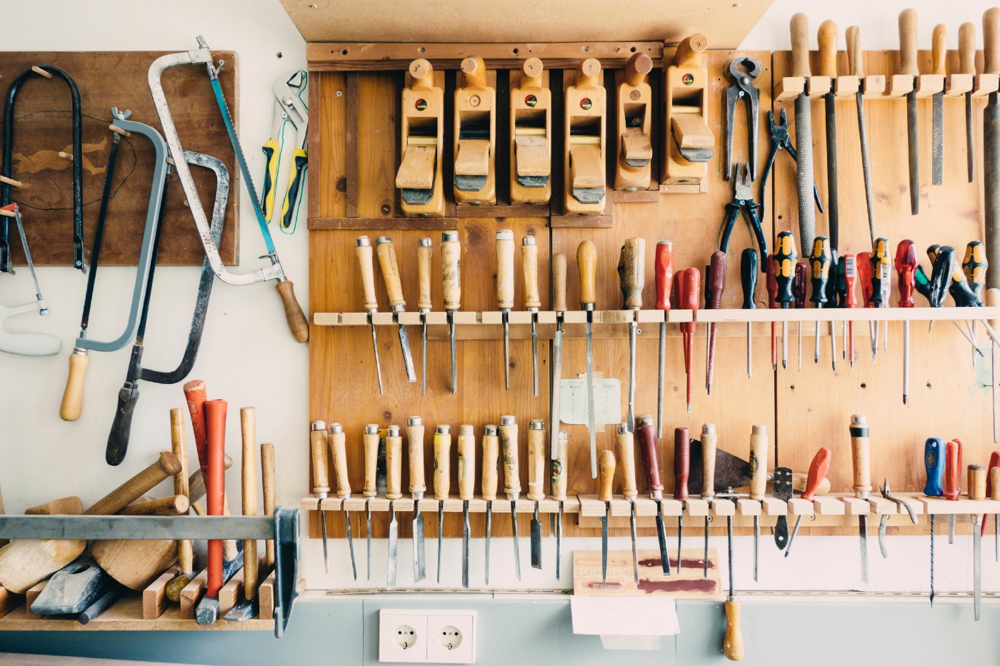

# История создания одного PWA

## Предистория

Летом 2017-го года взяв отпуск, поехал в Питер. Попутно гуляя по городу делал фотографии. Заметил, что Instagram никак не адаптирован для панорамных фотографий. Погуглив, не мог найти способа легко и удобно поделиться панорамными снимками, кроме как опубликовать в ленту Facebook

![image02][image02.png]

Летом 2018-го листая ленту Instagram, увидел как один человек разделил снимок на два изображения с соотношением сторон 1к1 и загрузил их в один пост. Из-за чего появился эффект панорамы.

[example](https://www.instagram.com/p/BoUq4mMlzUw/?utm_source=ig_embed)

Стал искать готовые приложения в Apple Store. Увидел парочку, но они были заточены на создание плитки на странице профиля, а не в одном посте.

Появилась идея написать свое приложение. Есть iPhone 5s, но нет знаний ни Objective-C, ни Swift. Появилась идея написать SPA (single page application) с помощью Vuejs. После наткнулся в Youtube на доклад 'Еще лучше чем настоящие'. Рекомендую его к просмотру тем кто ничего не слышал про PWA (progressive web application). PWA — это подход при создании веб-приложении что бы оно могло маскироваться под native app. Довольно интересная инициатива. После было принято решение написать, в качестве эксперимента, PWA для обрезки фото.

[доклад](https://youtu.be/Bhd5HQ1I2LM)

## Собираем прототип

Смысл приложения следующий: пользователь открывает сайт на iPhone в Safari. Загружает фотографию со своего девайса. Выбирает параметры для обрезки фото по вертикали: пополам или на 3/4/5 частей. Приложение обрезает фото. После, пользователь скачивает преобразованные фотографии на телефон для последующей публикации в Instagram.

Нашел в npm готовую библиотеку [jimp](https://www.npmjs.com/package/jimp), которая умеет делать манипуляции с изображениями в браузере. Сделал прототип и проверил его работу на desktop. Все шикарно работает. Ок, настало время тестировать функционал на телефоне. Запускаю webpack-dev-server и открываю Safari на телефоне. К сожалению обрезка фотографии на пополам занимает не меньше 20 секунд. Неудача.

Полез в исходники jimp что бы разобраться как он работает. Обнаружил, что для обрезки фотографий, приложение преобразовывает изображение в bitmap, проходит bitmap, собирая нужные пиксели. Задумался как реализовать на JS следующий кейс:

* Преобразование base64 строки изображения в bitmap
* Обрезка данных из bitmap
* Преобразование bitmap в base64 строку изображения

Сделав первый и третий шаг, начал собирать информацию по манипуляции с bitmap. Получил совет от коллег использовать canvas. Переписал скрипт обработки на canvas. Протестировал работу в desktop — все работает. Запускаю webpack-dev-server и открываю Safari на телефоне. Ура, время обработки заняло 3 секунды. Данная реализация подходит.

Что бы приложением было приятно пользоваться, подключил Bootstrap и накидал дизайн.

## Начинаем делать PWA

Первым делом соберем [веб-манифест](https://www.w3.org/TR/appmanifest/). Манифест — это JSON файл который рассказывает мобильному девайсу что это за приложение и как с ним взаимодействовать. Он содержит информацию о приложении, иконках, параметры запуска, цветовая схема, начальный url и прочее. Для Webpack есть полезный плагин который автоматизирует генерацию манифеста: [webmanifest-loader](https://www.npmjs.com/package/webmanifest-loader).

Следующий этап — настройка кэша приложения. В докладе Вадима Макеева, в качестве одного из примеров, приводится сайт [https://airhorner.com](https://airhorner.com). На github есть его [исходный код](https://github.com/GoogleChromeLabs/airhorn) и там можно увидеть имплементацию кэша. Для желающих разобраться в теме более подробно, есть замечательный сайт от Mozilla [https://serviceworke.rs](https://serviceworke.rs). Для текущего приложения, воспользовался готовым плагином для [Webpack](https://www.npmjs.com/package/appcache-webpack-plugin).

## Результат

В качестве результата, удалось организовать задумку от и до: [https://cropper.kopylovvladislav.com](https://cropper.kopylovvladislav.com). Приложение добавляется на Home Screen и потом запускается без доступа к интернету.

В качестве дополнительного бонуса, имплементация обрезки и изменения размера изображения с помощью canvas был оформлен в виде npm пакета: [https://www.npmjs.com/package/canvas_image_processing](https://www.npmjs.com/package/canvas_image_processing)

## Итоги

Конечно, есть косяки с работой кэша. iOS через каждые 4–5 часов удаляет кэш из-за чего нужно подключится к интернету что бы скачать ассеты и закешировать их (airhorner не стал исключением). Возможно, запускается механизм 'offloading unused data'. И на desktop браузеры реагирует на работу кэша по-разному: Safari сразу подтягивает обновления, а Opera никак не хочет уничтожать сохраненный кэш.

В общем, PWA является хорошей инициативой что бы сделать веб-приложения чуть приятнее, но это не заменит native apps.

[Medium](https://kopilov-vlad.medium.com/%D0%B8%D1%81%D1%82%D0%BE%D1%80%D0%B8%D1%8F-%D1%81%D0%BE%D0%B7%D0%B4%D0%B0%D0%BD%D0%B8%D1%8F-%D0%BE%D0%B4%D0%BD%D0%BE%D0%B3%D0%BE-pwa-d0a17096ad58)
