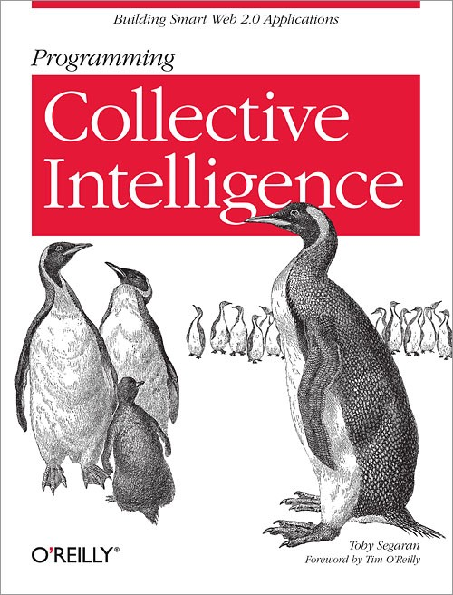

# Programming Collective Intelligence by Toby Segaran

It is an excellent book for beginners to try machine learning and statistics. While reading the book, you will be programming some machine learning algorithm from scratch (Bayes, k-nn, decision tree and others). The book has a lot of code snippets and little amount of math formulas.

I recommend the book if you are interested in machine learning and statistics. It will be a great intro.

[Medium](https://kopilov-vlad.medium.com/programming-collective-intelligence-by-toby-segaran-8167bdf98613)
