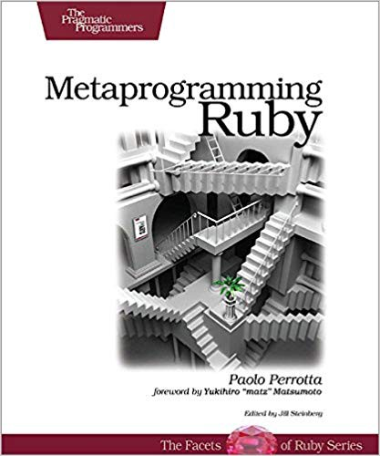

# Metaprogramming Ruby by Paolo Perrotta

Metaprogramming is writing code that manipulates language constructs at runtime. It is an essential component of Ruby, and you can use it to remove duplication in your code and write elegant, beautiful programs.

Metaprogramming is always interesting to me. I have had experience with it, but I still had questions about it. One of my colleagues recommended me to read the book. After that, I have found answers to all my questions. Therefore I highly recommend it everyone who wants to learn more about metaprogramming.

By reading the book, you will be able to learn new by one week. You will be able to understand new constructions, and you will see a lot of code examples (in plain Ruby and code in popular gems):

* how to create new methods in runtime with method_missing and respond_to_missing
* defining new methods in runtime with define_method construction
* how to pass constant by const_missing
* new way to create classes dynamically
* learn more about metaprogramming in ActiveRecords
* monkey patching and how to add a method to a class dynamically
* and you will reach the whole power of DSL (domain-specific language)

[Medium](https://kopilov-vlad.medium.com/metaprogramming-ruby-by-paolo-perrotta-4d22d60bf78b)
