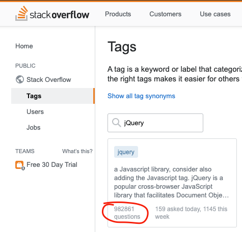

# Почему jQuery — это легендарный инструмент


(The Write Less, Do More)

Первый релиз jQuery был 26 августа 2006 (13 лет назад). Но почему мы все еще в 2020 обсуждаем эту библиотеку?

jQuery — это живая легенда веба и на это есть три причины:

* Удобство
* Стабильность
* Эпоха

## У — удобство


Библиотека подключалась одной строчкой с любого CDN

```
<script src="https://code.jquery.com/jquery-3.5.0.min.js"></script>
```

Для разработки достаточно было всего одной либы. В ней есть все необходимое для работы с DOM, анимацей и ajax-запросами. Плюс у нее всегда была очень подробная документация. Эта библиотека показала насколько удобной может быть работа с ajax-запросами и что работать с ними может каждый. (для молодых: fetch появился в js только с [Chrome 42](https://developers.google.com/web/updates/2015/03/introduction-to-fetch))

Она показала как крут chaining еще до изобретения промисов 😅. Вот такую красоту мог использовать любой и спокойно работать с элементами как с объектами.

```js
$("#p1")
  .css("color", "red")
  .slideUp(2000)
  .slideDown(2000);
$( "ul.first" )
  .find( ".foo" )
    .css( "background-color", "red" )
  .end()
  .find( ".bar" )
    .css( "background-color", "green" );
```

jQuery была настолько удобной что разработчики забывали ванильный js. Многим людям для того что бы переквалифицироваться из верстальщика в разработчика было достаточно за пару выходных изучить api jQuery. По этой причине в 2014 году появился сайт [youmightnotneedjquery.com](http://youmightnotneedjquery.com/)

Счастье разработчика не ограничивалось одним core-функционалом. Было и есть огромное количество плагинов для разнообразных операций (вплоть до математических 🤪).

## С — стабильность



Было время когда еще не было никаких менеджеров пакетов типо npm или yarn, но и не было проблем с установкой и управлением зависимостями. В гугле без труда можно было найти плагины на любую задачу. Каждый плагин был написан энтузиастом всего один раз и просто работал!

Люди находили плагины в гугле (привет, [ruseller.com](https://ruseller.com/)) или на страницах stackoverflow и просто подключали его к себе на сайт. Крафтовость разработки — 80-й уровень 🧔😎
Не важно когда плагин был написан, он работал стабильно.
[Все аккордеоны, тоглы, табы, простенькие модальные окна](https://github.com/petk/awesome-jquery) работали без постоянных патчей и багфиксов.

Но даже если версия jQuery на сайте отличалась от версии которая нужна была для правильной работы плагина, то внутри некоторых плагинов был уже встроенный "no conflict mode". Изнутри плагина запускалась нужная версия jQuery, а на сайте, в глобальном пространстве имен, разработчик спокойно использовал нужную ему версию jQuery.

Еще был надежный функционал [jQuery.noConflict()](https://api.jquery.com/jquery.noconflict/) который освобождал переменную $ для других библиотек 😻.

Бывало я и сам для себя писал плагинчики для jQuery 😀

Либа до сих пор поддерживается на github! [https://github.com/jquery/jquery/commits/master](https://github.com/jquery/jquery/commits/master) А сколько вы знаете фронтовых либ которые поддерживаются 13 лет к ряду?!

## Э — эпоха


jQuery — это эпоха которая еще не прошла. Разработчики до сих пор любят и используют jQuery ❤️.

Bootstrap только в феврале 2019-го смог избавиться от jQuery в своем коде, но каких усилий и временных затрат им это стоило. [https://github.com/twbs/bootstrap/pull/23586](https://github.com/twbs/bootstrap/pull/23586)

В статистике npm по jQuery вы можете увидеть 3,504,030 weekly downloads, и это в 2К20! [https://www.npmjs.com/package/jquery](https://www.npmjs.com/package/jquery)

jQuery до сих пор часть таких известных библиотек как:
* [https://www.npmjs.com/package/bootstrap-datepicker](https://www.npmjs.com/package/bootstrap-datepicker)
* [https://www.npmjs.com/package/owl.carousel](https://www.npmjs.com/package/owl.carousel)


Даже используя jQuery сейчас не приходиться думать про поддержку старых браузеров. Подключаешь jQuery 1.12 и твой ламповый сайтик работает на всех старых браузеров.

## Резюмируя.

Для многих олдов jQuery — это как первая машина! 🚙
Спустя десять лет человек может купить себе две BMW, но в душе он всегда помнит свою первую четырку которая просто работала и ни разу его не подводила 😊

До сих пор в 2020 году, если тебе нужно написать небольшое приложение, то бывает проще заюзать jQuery чем поднимать create-react-app

[Medium](https://kopilov-vlad.medium.com/%D0%BF%D0%BE%D1%87%D0%B5%D0%BC%D1%83-jquery-%D1%8D%D1%82%D0%BE-%D0%BB%D0%B5%D0%B3%D0%B5%D0%BD%D0%B4%D0%B0%D1%80%D0%BD%D1%8B%D0%B9-%D0%B8%D0%BD%D1%81%D1%82%D1%80%D1%83%D0%BC%D0%B5%D0%BD%D1%82-231dbf9ebe0f)
