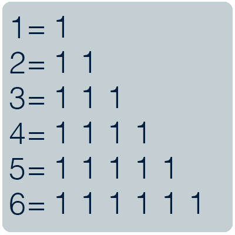
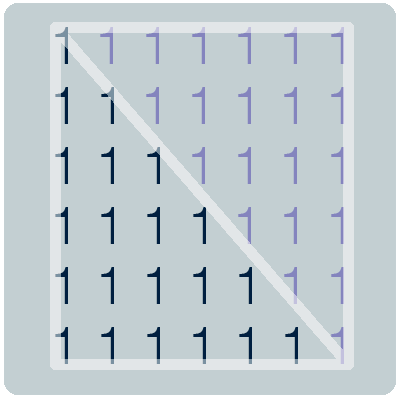
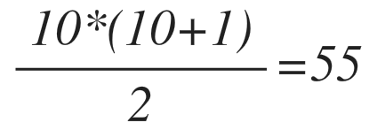

# Быстрый подсчет суммы ряда или из алгебры в геометрию

Как можно максимально эффективно вычислить сумму ряда чисел от 1 до n? Допустим, есть ряд чисел от 1 до 6. Надо вычислить его сумму. Делается это очень легко: 1+2+3+4+5+6 = 21. Ничего сложного!



Но если нужно подсчитать сумму ряда от 1 до 10 000 или от 1 до 100 000, или от 1 до 10 000 000, то тут столкнемся с трудностью. Во-первых, в уме их быстро не подсчитать. Во-вторых, если производить вычисления будет машина, то потребуется произвести количество вычислений равное длине последовательности.

Поэтому нужно найти более эффективный способ выполнить это.

У суммы ряда есть интереса особенность, если внимательно посмотреть на рисунок выше, то можно заметить что числа в такой последовательности представляют собой геометрическую фигуру, а именно прямоугольный треугольник. Для подтверждения верности нашего предположения, объединим две суммы ряда. У нас получается идеальный прямоугольник или два прямоугольных треугольника.



Следовательно, для того что бы вычислить сумму последовательности нужно вычислить площадь прямоугольного треугольника. Это значит, что рассчитать сумму ряда можно по следующей формуле, где n максимальное число в последовательности:


Используем формулу на практике. Нам нужно вычислить сумму последовательности от 1 до 10. Для этого нужно решить следующее простое уравнение:



Теперь рассмотрим на примере насколько эффективно вычислять сумму последовательности через площадь.

Для этого запрограммируем обе формулы: вычисление через сумму и вычисление через площадь треугольника. Для программирования используем язык ruby. Скажем машине что бы она вычислила несколько сумм последовательностей подряд с пределом от 2 до 100 000. А-ля:

* Вычисли сумму последовательности от 1 до 2
* Потом, вычисли сумму последовательности от 1 до 3
* Потом, вычисли сумму последовательности от 1 до 4
* …
* и наконец, от 1 до 100 000

Сначала вычислим методом сложения, а потом вычислим с помощью площади треугольника. Запомним время которое потребовалось для выполнения задач и выведем его что бы увидеть разницу. Вычисления проводились на компьютере с процессором Intel Core i5 (1,4GHz).

```ruby
#сумма последовательности через сложение
def summ(z)
  sum = 0
  for num in 1..z
    sum += num
  end
  sum
end

#сумма последовательности через площадь треугольника
def sum_triangle(z)
  ( z*(z+1) )/2
end


=begin
#тест что формулы идентичны
for num in 1..10000
  if summ(num)!=sum_triangle(num)
    puts "false if num = #{num}"
  end
end
=end


=begin
пусть мы подсчитаем подряд суммы последовательней c максимальным значением от 2 до 100 000
сумму последовательностей от 1 до 2
сумму последовательностей от 1 до 3
сумму последовательностей от 1 до 4
...
сумму последовательностей от 1 до 100 0000
=end
limit = 100000

begin_time = Time.now
  for num in 2..limit
    summ(num)
  end
puts Time.now - begin_time

begin_time = Time.now
  for num in 2..limit
    sum_triangle(num)
  end
puts Time.now - begin_time

#370 секунд
#0.02 секунды
```

Получается, что при вычислением методом сложения мы затратили 370 секунд, а при вычислением методом расчета площадь треугольника всего 0,02 секунды. Разница на лицо!

Для любопытства, запустим вычисления суммы последовательностей с пределом от 2 до 10 000 000 через площадь треугольника и зафиксируем время выполнения, что бы узнать сколько времени займет это вычисление. Удастся ли нам нагрузить машину дольше чем на одну секунду? Для вычислений этого потребовалось всего 1,7 секунд 😀.

Итог: некоторые задачки решаются намного эффективнее если посмотреть на них под другим углом. Это рождает более эффективные решения которые экономят ресурсы. При вычислений небольших чисел, например последовательности от 1 до 6, разница практические не ощутима, каким способом мы бы не решали. Но с увеличением объема вычислений разница будет видна все больше и больше.

[Medium](https://kopilov-vlad.medium.com/%D0%B1%D1%8B%D1%81%D1%82%D1%80%D1%8B%D0%B9-%D0%BF%D0%BE%D0%B4%D1%81%D1%87%D0%B5%D1%82-%D1%81%D1%83%D0%BC%D0%BC%D1%8B-%D1%80%D1%8F%D0%B4%D0%B0-%D0%B8%D0%BB%D0%B8-%D0%B8%D0%B7-%D0%B0%D0%BB%D0%B3%D0%B5%D0%B1%D1%80%D1%8B-%D0%B2-%D0%B3%D0%B5%D0%BE%D0%BC%D0%B5%D1%82%D1%80%D0%B8%D1%8E-114de88b4374)
