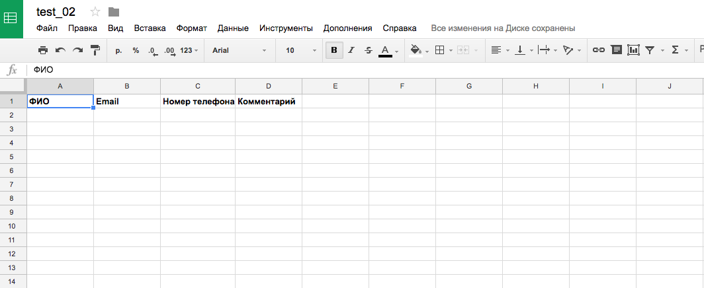
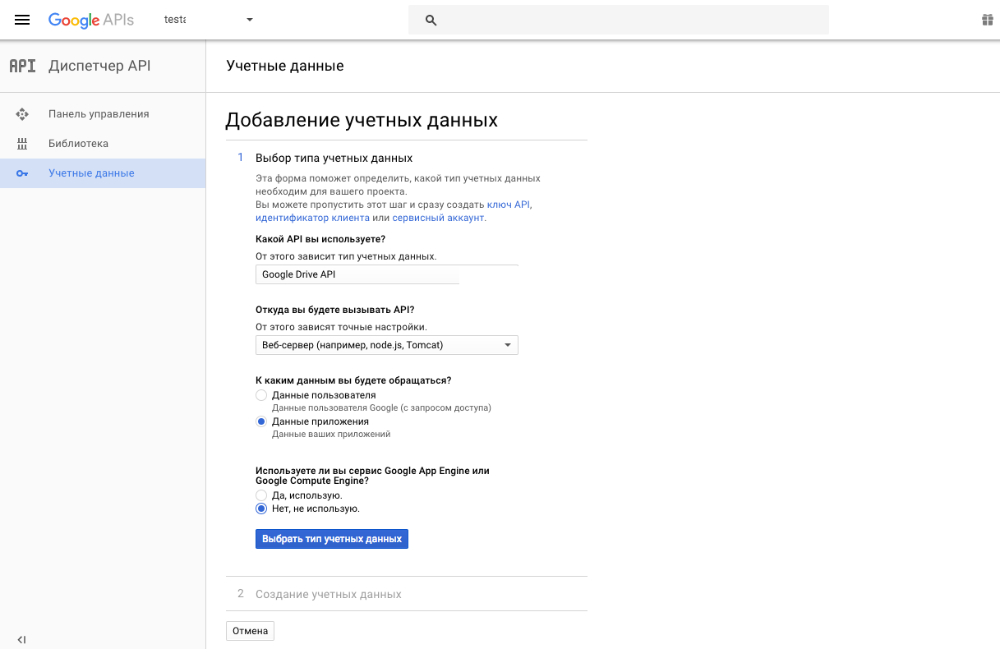

# Как просто подключить форму на лендинге к google таблице


У Phil Nash есть хорошая серия статей о том какие манипуляции возможно делать с google таблицами используя их API. В одной из статей есть короткий и простой туториал как подключить форму на посадочной странице (лендинг) к google таблице. Этот туториал может быть очень полезным в быту, он иллюстрирует простой (кустарный) способ как сделать легкую и небольшую автоматизацию. Для него нужно всего лишь готовый html-шаблон и доступ к аккаунту на google Drive. Функционал основан на готовой библиотеке [google_drive](http://www.rubydoc.info/gems/google_drive). С помощью нее можно читать/записывать информацию в файлы/таблицы в Google Drive/Docs.

В этой статье я хочу сделать адаптацию на русский язык. Ссылки на оригинальную серию статей есть в конце статьи. Данная статья подразумевает что читатель не впервой что либо программирует на языке ruby и на его компьютере уже установлен ruby со всем необходимым окружением.

## Подготовка google Drive

Первым делом заходим в свой аккаунт google, создаем новую таблицу и сохраняем ее с уникальным названием.



Заходим в [Google APIs Console](https://console.developers.google.com/).

Нажимаем ссылку “Включить API”. Далее, из всего разнообразия продуктов google, нас интересует “Google Drive API”. Так как у нас нет созданного профиля, высветиться предупреждение “Чтобы использовать этот API, нужно создать учетные данные.”. Нажимаем кнопку “Создать” и настраиваем доступы как на скриншоте.



На втором этапе:

* Придумываем и заполняем “Название сервисного аккаунта”
* Выбираем роль Project -> Редактор
* Оставляем Тип ключа -> json

Скачиваем файл-ключик на свой компьютер. Открывая его, найдем строчку с ключем "client_email". Это автоматически сгенерированный гуглом email. Запомним его значение. Осталось настроить права доступа google таблице. Нажмем кнопку "Настройки доступа", вставим туда сгенерированные email и вышлем приглашение.

Для подробностей, можно посмотреть [gif от Phil Nash](https://www.twilio.com/blog/wp-content/uploads/2017/02/google-developer-console.gif).

## Стучимся к таблице

Создадим простой скрипт что бы вывести данные из нашей google таблицы, а заодно проверить что доступы настроены правильно.

Создадим отдельную папку, например docs_test. Переместим в эту папку файл-ключик и переименуем его в client_secret.json. Создадим файл Gemfile и пропишем в него следующий код:

```ruby
source 'https://rubygems.org'
gem 'google_drive'
```

Запустим из консоли команду “bundle install”. Создадим файл app.rb и поместим в него следующий код:

```ruby
require 'bundler'
Bundler.require
doc_url = 'https://docs.google.com/spreadsheets/d/1-siWRqiCkMBixA-2rIQm_________/edit'
session = GoogleDrive::Session.from_service_account_key('client_secret.json')
spreadsheet = session.spreadsheet_by_url(doc_url)
worksheet = spreadsheet.worksheets.first
worksheet.rows.each { |row| puts row.first(6).join(' | ') }
```

В переменную doc_url нужно вместо текущего значения вставить url к google таблице. Запустим файл app.rb из консоли выполнив "ruby app.rb".

Если все настроено, но на экран выведется содержимое таблицы. Теперь можно заняться интеграцией формы на лендинге.

## Интеграция формы

Итак, у нас есть готовая верста лендинга, а именно:

* Файл index.html где находится вся верстка
* Остальные папки с ресурсами такими как: css, img, js, lib и прочее

Создадим папку, например landing_page и перейдем в нее. Переместим в эту папку файл-ключик и переименуем его в client_secret.json. Создадим файл Gemfile и запишем в него следующее:

```ruby
source 'https://rubygems.org'
gem 'google_drive'
gem 'sinatra'
```

Выполним "bundle install". Создадим папку public и перенесем в нее все папки с ресурсами которые нужны для верстки (css, img, js, lib и прочее). Создадим папку views и перенесем в нее файл index.html предварительно переименуя его в index.erb.

Теперь немного изменим форму на лендинге. В данном мануале описываем форма которая имеет три поля: ФИО, Email и Номер телефона. В верстке эти поля формы имеют значения атрибутов name: name, email и phone соответственно. Обернем форму в условие и добавим условия при удачной отправке данных и при ошибке:

```ruby
<!-- Просто загрузка страницы -->
<% if @status == :hello %>
  <form method="POST" action="/" style="max-width: 450px;">
    <div class="form-group">
      <label for="exampleInputFIO1">ФИО</label>
      <input type="text" class="form-control" name="name" id="exampleInputFIO1" placeholder="Иванов Иван Иванович">
    </div>
    <div class="form-group">
      <label for="exampleInputEmail1">Email</label>
      <input type="email" class="form-control" name="email" id="exampleInputEmail1" placeholder="ivanov@gmail.com">
    </div>
    <div class="form-group">
      <label for="exampleInputPhone1">Номер телефона</label>
      <input type="phone" class="form-control" name="phone" id="exampleInputPhone1" placeholder="+7(915)435-22-55">
    </div>
    <button type="submit" class="btn btn-outline btn-xl page-scroll">Отправить</button>
  </form>
<% end %>

<!-- Оповещение об удачной отправке данных -->
<% if @status == :success %>
  <p>Ура! Данные получены</p>
<% end %>

<!-- Оповещение об ошибке при отправке данных -->
<% if @status == :error %>
  <p>
    Возникла ошибка при сохранении данных.
    <br>
    Повторите действие позже
  </p>
<% end %>
```

Теперь создаем файл app.rb в котором будет вся логика работы.

```ruby
require 'bundler'
require 'sinatra'
Bundler.require

# файл-ключик с доступами
KEY_FILE = 'client_secret.json'

# ссылка на таблицу в google drive
FILE_URL = 'https://docs.google.com/spreadsheets/d/1-siWRqiCkMBixA-_________/edit'

# инициализация доступа к таблице на google drive
def worksheet
  @session ||= GoogleDrive::Session.from_service_account_key(KEY_FILE)
  @spreadsheet ||= @session.spreadsheet_by_url(FILE_URL)
  @worksheet ||= @spreadsheet.worksheets.first
end

# обработчик загрузки страницы
get '/' do
  @status = :hello
  erb :index
end

# обработчик отправки формы
post '/' do
  # собираем даные из формы
  new_row = [params['name'], params['email'], params['phone'], 'Новая заявка']
  
  begin
    # делаем попытку сохранить данные в google drive
    worksheet.insert_rows(worksheet.num_rows + 1, [new_row])
    worksheet.save
    @status = :success
    erb :index
  rescue
    # если не получилось сохранить - выведем сообщение об ошибке
    @status = :error
    erb :index
  end
end
```
Отлично, теперь можно запустить наш лендинг локально, выполнив "bundle exec ruby app.rb". Увидеть его и отправить данные можно зайдя локально на http://localhost:4567/.

Вот таким способом можно собирать подписную базу с лендинга на google Таблицы. Этот маленький скрипт можно без проблем загрузить на сервер и проверить работоспособность там.

[Ссылка на мой репозиторий в github](https://github.com/kopylovvlad/landing_with_google)

## Что же дальше?

На данном этапе не стоит прекращать усилия и радоваться минимальному функционалу который у нас получился.

Далее следует улучшить функционал и самостоятельно добавить:

* Маски ввода информации на полях формы
* Валидацию правильности ввода данных (на фронте и бэке)
* Сбор и сохранение информации об utm-метках, что бы знать откуда пользователь пришел на страницу
* Подключить e-mail уведомления о полученной информации
* Сделать отправку данных без перезагрузки всей страницы
* И многое другое на что хватит фантазии

Ссылки на оригинальную серию статей:

* https://www.twilio.com/blog/2017/03/google-spreadsheets-ruby.html
* https://www.twilio.com/blog/2017/03/create-a-landing-page-with-sinatra-google-spreadsheets-and-ruby.html
* https://www.twilio.com/blog/2017/06/validate-ruby-objects-with-active-model-validations.html

[Medium](https://kopilov-vlad.medium.com/%D0%BA%D0%B0%D0%BA-%D0%BF%D1%80%D0%BE%D1%81%D1%82%D0%BE-%D0%BF%D0%BE%D0%B4%D0%BA%D0%BB%D1%8E%D1%87%D0%B8%D1%82%D1%8C-%D1%84%D0%BE%D1%80%D0%BC%D1%83-%D0%BD%D0%B0-%D0%BB%D0%B5%D0%BD%D0%B4%D0%B8%D0%BD%D0%B3%D0%B5-%D0%BA-google-%D1%82%D0%B0%D0%B1%D0%BB%D0%B8%D1%86%D0%B5-c74ed782d874)
