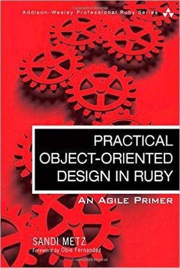

# Обзор на книгу Practical Object-Oriented Design In Ruby

Многие рубисты хвалят эту книгу и советуют ее прочитать. Автор книги Сэнди Метц — настоящий профессионал своего дела имеющий за плечами более 30 лет опыта. В данной книге в изобилие не только теория, но есть подробные примеры кода. Книжка не зря имеет больше сотни положительных отзывов на Amazon.

Данная книга разбита на 9 глав каждая из которых содержит интересную и ценную информацию:

**"Designing Classes with a Single Responsibility"** — содержит информацию о создании классов и методов по принципу единственной ответственности.

**"Managing Dependencies"** — данная глава содержит информацию об инъекций зависимостей, о том какие проблемы это может породить и о том как их решать.

**"Creating Flexible Interface"** — содержит исчерпывающую информацию о публичных и приватных методов у классов. В ней вы найдете советы как грамотно разрабатывать интерфейсы.

**"Reducing Costs with Duck Typing"** — про то как писать более понятный и простой код используя возможности утиной типизации.

**"Acquiring Behavior Throught Inheritance"** — содержит тонну полезного текста про наследования. Вам повезло если всю эту информацию вы слышали еще во время учебы в ВУЗе. Для всех остальных, эта глава даст исчерпывающие ответы на вопросы о наследовании.

**"Sharing Role Behavior with Modules"** — очень крутая глава про миксины. Содержит много полезной информации о том как работать с миксинами и как это отличается от классического наследия.

**"Combining Objects with Composition"** — подробная глава про объединение объектов в одно целое путем составления композиций.

**"Designing Cost-Effective Tests"** — очень крутая глава про тесты.

Данная книга хороша для студентов старших курсов технических вузов которые найдут в ней тонну полезной информации. Уверенный разработчик, который перешел в ruby из других языков, тоже найдет для себя пару полезных глав. Не смотря на то, что некоторые вещи слышал еще на лекциях в ВУЗе, есть информация которую я взял на заметку. Очень хорошая подача материала, во время чтения ловишь себя на мысль: "жаль что данная не попалась мне раньше". Рекомендую всем кто её еще не читал. [Ссылка на amazon](https://www.amazon.com/Practical-Object-Oriented-Design-Ruby-Addison-Wesley/dp/0321721330)

[Medium](https://kopilov-vlad.medium.com/%D0%BE%D0%B1%D0%B7%D0%BE%D1%80-%D0%BD%D0%B0-%D0%BA%D0%BD%D0%B8%D0%B3%D1%83-practical-object-oriented-design-in-ruby-9204d4e1e570)
