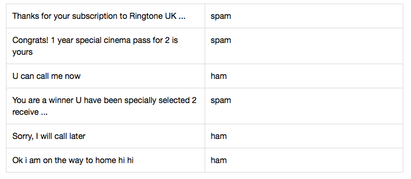
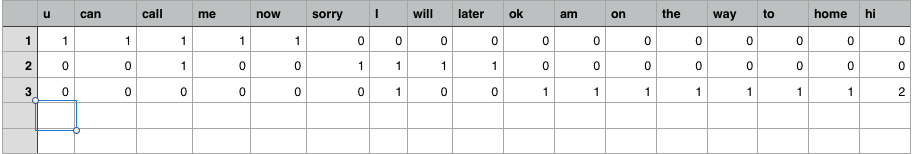
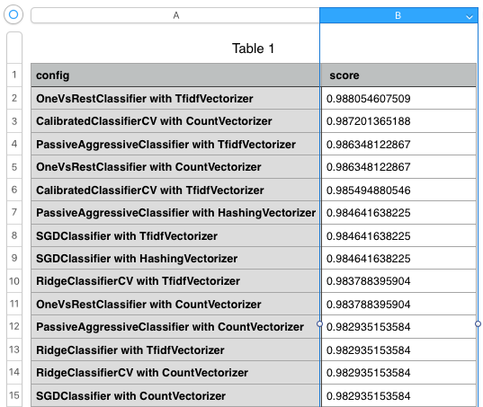
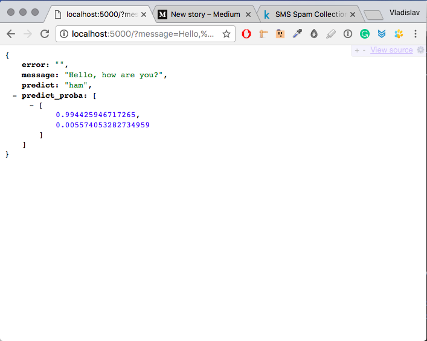

# Write SMS-spam detector with Scikit-learn


## Introduction

Solving problems with using machine learning is popular now. Maybe you have seen Competitions on Kaggle, courses on Coursera or EdX. For ML we have many tools like Scikit-learn, Tensor-flow, Caffe, Spark MLib and another.

One of the basic and popular tasks is classification any data (text or images). In this article, you can read about using Scikit-learn for detecting SMS-spam in a text.

The Basic algorithm for solving a task like this is:

* Collect data and classify it
* Divide data-set to teach-set and test-set
* Collect classifiers and vectorizers
* Fit each classifier with teach-set and calculate accuracy with test-set
* Find classifier with the biggest accuracy
* Write API

## Starting

For this example, I will write a script for task [SMS Spam Collection Dataset](https://www.kaggle.com/uciml/sms-spam-collection-dataset) on [kaggle.com](https://www.kaggle.com/).

Click on [link](https://www.kaggle.com/uciml/sms-spam-collection-dataset), log in and download file spam.csv. This file contains a set of 5,574 SMS tagged messages in English. Each message is tagged as ‘ham’ (legitimate) or ‘spam’.



For classification, I will use library [Scikit-learn](http://scikit-learn.org/). It contains many methods for:

* classification, regression and anomaly detection
* implements the k-nearest neighbors algorithm
* decision tree-based models for classification and regression
* implements Naive Bayes algorithms and other modules.

Documentation [https://scikit-learn.org/stable/modules/classes.html](https://scikit-learn.org/stable/modules/classes.html)

Each of this module is a black box with the same interface.

* **Fit()** — method for teaching classifier
* **Score()** — method that returns the mean accuracy on the given test data and labels.
* **Predict()** — method for making prediction. For example: ‘ham’ or ‘spam’
* **Predict_score()** — method that returns probability estimates for each predictions. For example: 0.8 for ‘ham’ and 0.2 for ‘spam’.

## Vectorizers

But every of this module does not understand plain text; they need an array of features. How to build feature vectors from plain text?
For it, Scikit-learn has vectorizers: CountVectorizer, TfidfVectorizer, HashingVectorizer.

Example how to work CountVectorizer. It converts a collection of text documents to a matrix of token of unique words counts. It finds all unique words in text-set and makes one vector. After, it converts each text to an array of unique words counts. And as a result, we have one vector of unique words and many arrays with many count of zero. Example for data-set with 3 messages:

* U can call me now
* Sorry, I will call later
* Ok i am on the way to home hi hi



Another is TfidfVectorizer. It is an implementation of Term Frequency times Inverse Document Frequency algorithm. You can read about it in official documentation.

## About testing

Another question, how to test score of classification?
There is one way. We need to divide one data-set (spam.csv) to two data-sets (teach-set and test-set) with the ratio 80/20 or 70/30.
We will use teach-set for teaching classifier and test-set for calculating accuracy.

## Start coding

After the theory, we can start coding. Standart python script for running Scikit looks like this:

```python
from sklearn.naive_bayes import *
from sklearn.dummy import *
from sklearn.ensemble import *
from sklearn.neighbors import *
from sklearn.tree import *
from sklearn.feature_extraction.text import CountVectorizer
from sklearn.feature_extraction.text import TfidfVectorizer
from sklearn.feature_extraction.text import HashingVectorizer
from sklearn.calibration import *
from sklearn.linear_model import *
from sklearn.multiclass import *
from sklearn.svm import *
import pandas


def perform(classifiers, vectorizers, train_data, test_data):
    for classifier in classifiers:
      for vectorizer in vectorizers:
        string = ''
        string += classifier.__class__.__name__ + ' with ' + vectorizer.__class__.__name__

        # train
        vectorize_text = vectorizer.fit_transform(train_data.v2)
        classifier.fit(vectorize_text, train_data.v1)

        # score
        vectorize_text = vectorizer.transform(test_data.v2)
        score = classifier.score(vectorize_text, test_data.v1)
        string += '. Has score: ' + str(score)
        print(string)

# open data-set and divide it
data = pandas.read_csv('spam.csv', encoding='latin-1')
learn = data[:4400] # 4400 items
test = data[4400:] # 1172 items

perform(
    [
        BernoulliNB(),
        RandomForestClassifier(n_estimators=100, n_jobs=-1),
        AdaBoostClassifier(),
        BaggingClassifier(),
        ExtraTreesClassifier(),
        GradientBoostingClassifier(),
        DecisionTreeClassifier(),
        CalibratedClassifierCV(),
        DummyClassifier(),
        PassiveAggressiveClassifier(),
        RidgeClassifier(),
        RidgeClassifierCV(),
        SGDClassifier(),
        OneVsRestClassifier(SVC(kernel='linear')),
        OneVsRestClassifier(LogisticRegression()),
        KNeighborsClassifier()
    ],
    [
        CountVectorizer(),
        TfidfVectorizer(),
        HashingVectorizer()
    ],
    learn,
    test
)
```

After running, we can insert all data to CSV-file and find classifier with maximum score.



Combination OneVsRestClassifier with TfidfVectorizer has maximum result of score. After it, let’s see each prediction more detail and save a report to CSV-file.

```python
from sklearn.naive_bayes import *
from sklearn.dummy import *
from sklearn.ensemble import *
from sklearn.neighbors import *
from sklearn.tree import *
from sklearn.feature_extraction.text import CountVectorizer
from sklearn.feature_extraction.text import TfidfVectorizer
from sklearn.feature_extraction.text import HashingVectorizer
from sklearn.calibration import *
from sklearn.linear_model import *
from sklearn.multiclass import *
from sklearn.svm import *
import pandas
import csv

data = pandas.read_csv('spam.csv', encoding='latin-1')
train_data = data[:4400] # 4400 items
test_data = data[4400:] # 1172 items

classifier = OneVsRestClassifier(SVC(kernel='linear'))
vectorizer = TfidfVectorizer()

# train
vectorize_text = vectorizer.fit_transform(train_data.v2)
classifier.fit(vectorize_text, train_data.v1)

# score
# vectorize_text = vectorizer.transform(test_data.v2)
# score = classifier.score(vectorize_text, test_data.v1)
# print(score) # 98,8


csv_arr = []
for index, row in test_data.iterrows():
    answer = row[0]
    text = row[1]
    vectorize_text = vectorizer.transform([text])
    predict = classifier.predict(vectorize_text)[0]
    if predict == answer:
        result = 'right'
    else:
        result = 'wrong'
    csv_arr.append([len(csv_arr), text, answer, predict, result])


# write csv
with open('test_score.csv', 'w', newline='') as csvfile:
    spamwriter = csv.writer(csvfile, delimiter=';',
            quotechar='"', quoting=csv.QUOTE_MINIMAL)
    spamwriter.writerow(['#', 'text', 'answer', 'predict', result])

    for row in csv_arr:
        spamwriter.writerow(row)
```

After run that script, open test_score.csv and you can see 14 wrong predictions vs 1158 right. It is amazing!

For making accuracy bigger, we can use various stemming like [stemming 1.0](https://pypi.python.org/pypi/stemming/1.0) for English. Or [Mystem from Yandex](https://tech.yandex.ru/mystem/) for Russian. But I don’t want it.

I think, 98,8% is very good and now we can write API. For writing API we will use [Flask](http://flask.pocoo.org/). Flask is a microframework for Python. It is pretty simple and has many useful features.

```python
import os
from flask import Flask, render_template, request, redirect, url_for, jsonify
from sklearn.feature_extraction.text import TfidfVectorizer
from sklearn.multiclass import *
from sklearn.svm import *
import pandas

app = Flask(__name__)
global Classifier
global Vectorizer

# load data
data = pandas.read_csv('spam.csv', encoding='latin-1')
train_data = data[:4400] # 4400 items
test_data = data[4400:] # 1172 items

# train model
Classifier = OneVsRestClassifier(SVC(kernel='linear', probability=True))
Vectorizer = TfidfVectorizer()
vectorize_text = Vectorizer.fit_transform(train_data.v2)
Classifier.fit(vectorize_text, train_data.v1)


@app.route('/', methods=['GET'])
def index():
    message = request.args.get('message', '')
    error = ''
    predict_proba = ''
    predict = ''

    global Classifier
    global Vectorizer
    try:
        if len(message) > 0:
          vectorize_message = Vectorizer.transform([message])
          predict = Classifier.predict(vectorize_message)[0]
          predict_proba = Classifier.predict_proba(vectorize_message).tolist()
    except BaseException as inst:
        error = str(type(inst).__name__) + ' ' + str(inst)
    return jsonify(
              message=message, predict_proba=predict_proba,
              predict=predict, error=error)

if __name__ == '__main__':
    port = int(os.environ.get('PORT', 5000))
    app.run(host='0.0.0.0', port=port, debug=True, use_reloader=True)
```

Run this script and open http://localhost:5000/ in a browser.



That is all. If you want, you can see additional resources:
* [github](https://github.com/kopylovvlad/python_spam_detection)
* [kaggle](https://www.kaggle.com/kopylovlvad/scikit-onevsrestclassifier-and-tfidfvectorizer)

[Medium](https://kopilov-vlad.medium.com/detect-sms-spam-in-kaggle-with-scikit-learn-5f6afa7a3ca2)
