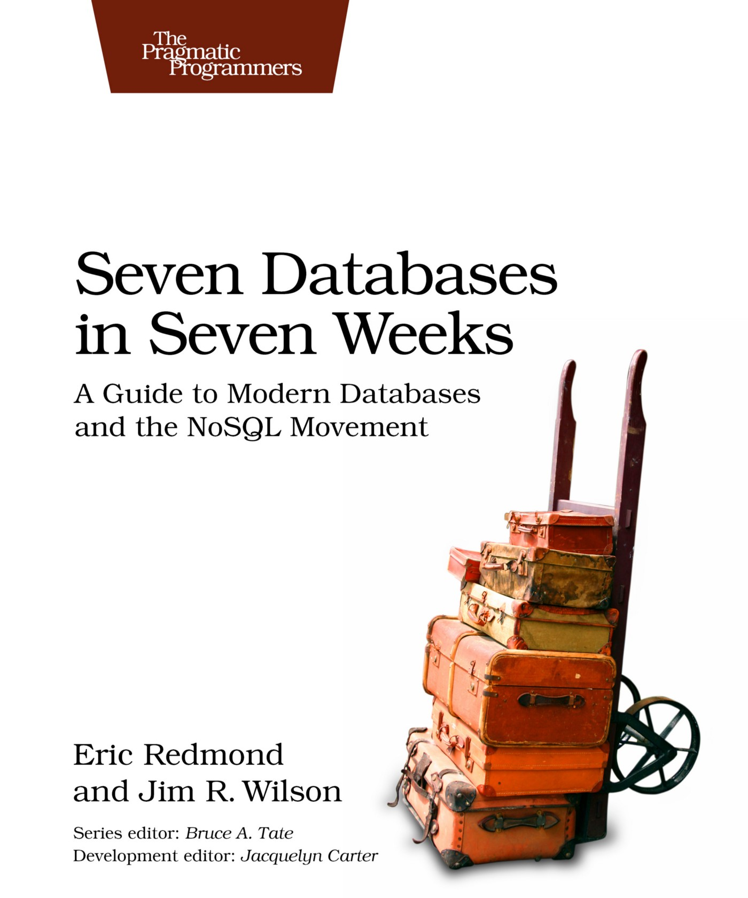

# Seven databases in seven weeks by Eric Redmond, Jim R. Wilson

I think, the book is a great tutorial. It is short and interesting. If you want to learn something new, but don’t have enough time, the book is an excellent gift for you. The book consists of 3 lessons for each database. Each part of the book ends with a wrapping-up chapter with the good and bad points about the database and some exercises. It’s an effective way to learn new about PostgreSQL, Riak, Apache HBase, MongoDB, Apache CouchDB, Neo4J, and Redis by one course.

I think it’s an excellent book for every student in CS classes. I highly recommend it. But, don’t consider the book as a detailed study course. It’s just a crash course for each database.

[Medium](https://kopilov-vlad.medium.com/seven-databases-in-seven-weeks-by-eric-redmond-jim-r-wilson-7931083106b2)
