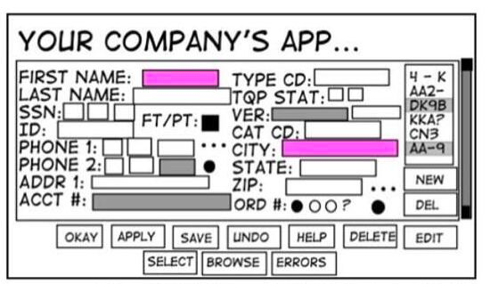

# Почему jQuery сдал позиции в эпоху SPA

В моем предыдущем посте я так нахваливал jQuery что у читателя мог возникнуть вопрос "Почему тогда большие приложения пишутся на react, vuejs и других инструментов?"

Да, jQuery сдал позиции другим библиотекам и на это есть две причины:

* Пришла эпоха SPA (single page application)
* Победа декларативной парадигмы программирования

## Почему пришла эпоха SPA ?

Типичное веб-приложение, будь то CRM или очередная CMS — это сложная штука с огромным количеством кнопочек и UX элементов.
А если этим сервисом пользуется большое кол-во человек то продакшн сервера пыхтят и тратят много сил на отрисовку html.

И однажды появилась идея 💡:

* Почему бы не прекратить рендерить страницу каждый раз заново, а пусть лучше веб-клиент отправляет post-запрос на сервер, получает результат и меняет данные там где нужно 🤔
* Пусть на сайте новостей при клике на новость не перерисовывается вся страница, а отправляется GET-запрос на сервер. Клиент получает заголовок, текст и заменяет данные 🤔
* Пусть клиент всего один раз загружает весь html, css и js а дальше обменивается с сервером только необходимыми данными. 🤔

Это же удобно! 😃

Были небольшие эксперименты но, они были не настолько удачными чтобы стать массовыми. Backbonejs показал что классический ООП-подход плохо ложиться на функционал в браузере клиента.

Работа браузера полностью асинхронная, данные должны летать туда-сюда, кнопочки нажимаются в разные моменты времени, каждую минуту тригерятся разнообразные события. Как не странно, но на это очень хорошо лег функциональный подход.

Первая хорошая реализация стала Angular/Ember.js 🤓. Но это был полноценный фреймворк. На нем с нуля надо было писать приложения и процесс обучения занимал много времени.

После этого стартовал react. 😎 Его киллер фича была в том что react — это библиотека и он продвигал функциональный подход. Его можно было просто встроить в проект в виде небольшого функционала (чатик, калькулятор или прочее).

SPA сперва был прекрасен только для приложений и админок. Но потихоньку пришел server site rendering (SSR) и при помощи SPA можно было спокойно пилить любой медиа-ресурс.

Позже маркетологи все это увидели и сказали: "Да с помощью технологии SPA мы можем бесконечный скролл реализовать!!! И вставить кучу рекламы между статьями!" 💵💵💵💵💵

## Победа декларативной парадигмы программирования

Чем конкретно хороши эти инструменты для разработчика? Тем что не надо в явном виде ковыряться в DOM! Это реально очень удобный подход, объясню на примере vuejs:

* Сверстал компонент
* Разметил куда должны попадать данные из store
* Навесил события на кнопочки и переключатели (остальное за тебя сделал two-way data binding)
* Описал сериализацию данных перед отправкой на бэк и описал как данные с бека попадают в store
* Все! После этого все работает!

Ты описываешь data-flow (и иногда немного допиливаешь его напильником). А то как в явном виде передаются данные за тебя делает библиотека. Это была победа декларативного подхода в программировании! 👏

Vuejs — показал каким может быть реально удобный cli, как просто поднять проект и что для SPA нужно всего три либы: vue, vuex, vue-router (ну и Axios иногда 😅 ).

Работая с vuejs невозможно подумать что работа с формами может быть сложной (привет, react). Все это облегчило написание больших приложений, но и снизило входной порог в профессию.

## Мир дальше углубился в разделение труда

Я, как backend разработчик, счастлив таким положением дел. Моя работа:

* Получил от клиента http-запрос
* Взял данные из БД
* Положил их в json и отправил назад

Каждый в команде занимается своим делом. Фронты верстают, пишут js-код, вставляют данные в красивую верстку. Сейчас осталось мало мест где для правок дизайна проекта, фронту надо поднимать монолит искать где тут вьюхи чтобы их править. Backend программистам не надо ковырять html. Все разработчики занимаются своим любимым делом ❤️

## React плох, но он набрал критическую массу

[Даже создатель react хочет уничтожить эти либы 👿](https://twitter.com/acdlite/status/1022306639498506240)

Когда один инструмент набирает критическую массу пользователей это может быть опасно. Потому что людям сложно слезть с того что привычно.

Это тоже самое как во время всеобщей пандемии и самоизоляции люди продолжают использовать zoom, в котором большие проблемы с безопасностью. Просто все к нему привыкли и проще написать коллеге "давай созвонимся в zoom?" и получить положительный ответ чем "давай созвонимся в skype".

Так чем плох реакт? 🤔 Тем что эта библиотека до сих пор заставляет разработчиков плакать если на нем писать большие приложения 😭

* Плохая реализация tree-shaking. Хочется как можно быстрее отдать клиенту его бандл чтобы он был как можно быстрее счастлив, но нет (вы проверяли сколько весит ваш hello world на react?)
* Работа с формами — это боль 🤦‍♀️
* Сложность экосистемы и ее многословность. Берем стандартный react стек: react, redux, redux form, redux-saga и прочее. И я вспоминаю, как раньше шутили о джаве: "*Взял одно, другое, склеил первое, второе, третье, написал конфиг. В итоге ты поднял простенький hello world, но выглядит это как enterprise решение для малого бизнеса.*"
* Один паттер проектирования — компоненты высшего порядка, который очень плохо заходит новичкам. Плюс при разработке оказывается что в погоне за этой архитектурой начинается куча проблем. Мы обнаруживаем что одни обертки высших порядков зависят от других; что их надо не забыть перечислять в правильном порядке; что писать типы для компонентов высшего порядка либо боль, либо сложно, либо неэффективно.
* Нет одной каноничной жесткой архитектуры с необходимыми абстракциями из коробки. В компонентах очень легко смешать логику и представление в беспорядочную мешанину. Из-за этого большие приложения легко и непреднамеренно превращаются в месиво кода.
* Где конфигурация для create-react-app? И почему это не может быть в react-cli из коробки? После vuejs это все выглядит очень дико.

Хоть мне и очень нравиться подход в vuejs, но никто в здравом уме не будет переписывать работающий большой проект с react на vuejs или ember. Это неадекватно с точки зрения затраты сил и ресурсов.

## А что с jQuery?

Он просто работал и не пытался играть в гонку с другими js-библиотеками. jQuery идеальная для того что бы найти нужные элементы в DOM. Да, это просто либа, и она не дает какой либо каркас приложения но в то время это было не нужно.

И тут эпоха SPA заявила: «В DOM мы руками больше не лезем! Это сложно, медленно и от этого на проекте куча багов!»

Поэтому jQuery так и остался либой для работы с DOM, так как никому не пришла в голову идея доработать его для SPA:

* Взять уже готовый handlebars.js для html-шаблонов
* Написать с нуля store
* Функционал для http-запросов уже есть из коробки ([даже в документации react написано что для http-запросов хорошо подходит jQuery](https://reactjs.org/docs/faq-ajax.html))
* Написать роутер
* Реализовать необходимый функционал для two-way data binding

То есть инструмент похожий на vuejs мог появится раньше, но с нативной поддержкой http-запросов из коробки. А еще бы добавить к этому create_app как во vue cli и поддержку coffeescript из коробки 😍 Ваще красота) 🔥

Вот так этот старичок оказался преданным своему делу, но потерял позиции перед другими инструментами. Но не все так плохо, он все еще остался хорош для парсинга сайтов: удобный api для http-запросов и самый простой интерфейс для ковырянии в DOM’е 👨‍💻

[Medium](https://kopilov-vlad.medium.com/%D0%BF%D0%BE%D1%87%D0%B5%D0%BC%D1%83-jquery-%D1%81%D0%B4%D0%B0%D0%BB-%D0%BF%D0%BE%D0%B7%D0%B8%D1%86%D0%B8%D0%B8-%D0%B2-%D1%8D%D0%BF%D0%BE%D1%85%D1%83-spa-97fc7fb30c15)
