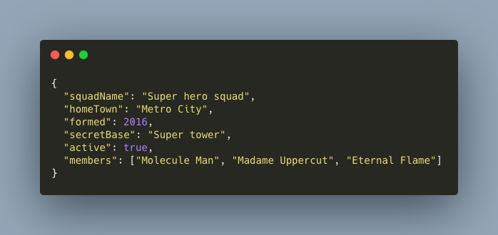
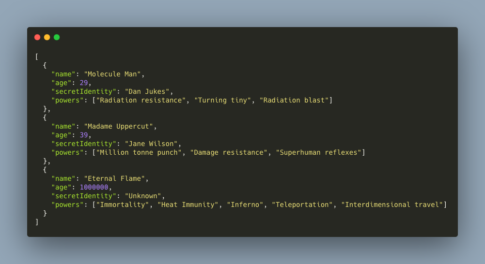
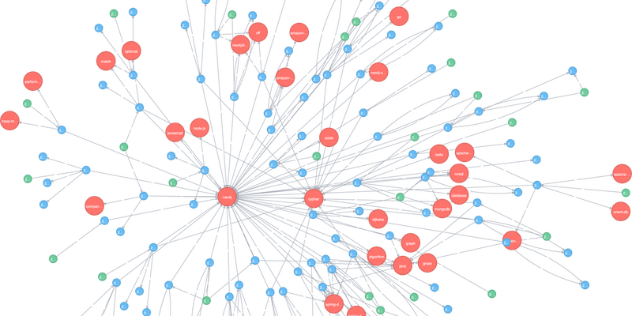

# Откуда такой зоопарк баз данных или введение в разнообразие БД


## Введение

Каждый разработчик задавал себе вопрос почему существует так много языков программирования или баз данных. Ответ скрывается в том что каждый инструмент хорошо подходит только для своей задачи, а в других условиях становится не эффективным. Найти информацию о разнообразии языков не составит труда. Насчет баз данных хочется выразить свое мнение. Почему появилось разделение БД на SQL и NoSQL и было ли что-то до создания SQL.

## Темные времена


История любой индустрии всегда начинается с темных времен или момента рождения. Применительно к БД мне нравится выражение "темные века".

Изначально никаких стандартов для БД не было. У каждого компьютера или мейнфрейма была своя имплементация БД. Чаще всего программист не делал в явном виде запрос к данным, а программировал их сам, выделяя для этого память в переменных и сам писал циклы чтобы подгрузить данные или связи.

С 1970-х начался новый тренд, БД представляли собой таблицы в которых была сложена информация. Как в привычном нам Microsoft Excel.

## Ренессанс


Смена эпох наступила в 1974 когда IBM впервые представил свою первую имплементацию SQL. SQL менял подход в декларативную сторону и подкупил всех тем что не нужно самому программировать запросы к данных. У программистов уже появился интуитивно понятный интерфейс как это делать. Операторы SELECT и JOIN произвели революцию в своей индустрии. Вот пример запросов на языке SQL.

```sql
SELECT first_name, last_name FROM people;
SELECT people.last_name, people.first_name, people.profession_id FROM people INNER JOIN profession ON people.profession_id=profession.id WHERE profession.id = 123;
```

В 80-х годах SQL стал настоящим стандартном ANSI и ISO под который можно было написать свою систему управления базами данных (СУБД), что запустило эпоху ренессанса в мире БД.

SQL удовлетворял все коммерческие запросы к сохранности и надежности данных: блокировки, транзакции, внешние ключи, проверки на NULL, хранимые процедуры и прочее. Плюс была проделана огромная работа в исследовании, проектировании и работы с реляционными БД, что сделало эту систему стандартом индустрии. Казалось что в базах данных ничего никуда меняться не будет.

Дополнительно надежность SQL была гарантирована [схемой данных](https://en.wikipedia.org/wiki/Database_schema) то есть на данные можно в любой момент посмотреть сверху как на план, как на карту города и схема гарантировала что все данных соответствуют этому плану. Пример: если в схеме написано что в таблице USERS поле FIRST_NAME является строкой и не может содержать NULL, то вариант что у какой-то записи там ничего нет или содержится число попросту не возможен.

### Плюсы SQL:

* Накоплен большой опыт проектирования и использования реляционных баз данных
* Надежность хранения данных
* Разнообразные СУБД как имплементации стандарта

### Минусы SQL:

* Плохо подходят для сложных поисков по тексту (морфологический/префиксный поиск)
* Плохо подходит для реализации данных которые можно представить как граф

## Эпоха модерна


После долгой эпохи ренессанса наступает эпоха модернизма в мире баз данных. Программное обеспечение с каждым годом усложнялось, приложения становились более сложные, требования к ним более извращенные и в 2000-х в SQL стали находить узкие места которые не удовлетворяли по эффективности использования. Плюс не все данные удобно комплектовать в виде таблицы. Эти запросы пытаются удовлетворить новые более легкие и малые NoSQL решения.

До сих пор отношение к NoSQL решениям различные: кто-то считает это все игрушками, а кто-то узкими эффективными инструментами. Рассмотрим для примера несколько БД и поймем в чем их преимущества и минусы: Redis, MongoDB, ElasticSearch и Neo4j.

Дополнительно перед использованием каждой новой NoSQL БД надо было учиться заново т.к. у каждой из них есть свой уникальный язык запросов.

## Redis



Эту БД можно представить в виде большого ассоциативного массива (ключ/значение) или одного JSON объекта. Оно представляет собой структуру данных где какая-то схема не нужна, важна только скорость записи/чтения. Ассоциативный массив для этого идеально подходит так как сложность поиска по нему [О(1)](https://en.wikipedia.org/wiki/Hash_table).

В Redis хранят данные к которым критически важна скорость доступа, и их не жалко потерять. Пример: данные о сессии, кэш, результаты промежуточных вычислений, очереди задач. Запускать для этих целей инстанс PSQL было бы неэффективно, а отдельная маленькая БД — самое оно.

Еще одно применение это БД — это коммуникация между процессами или доставка уведомлений. В Redis очень хорошо сделан функционал [подписки на каналы](https://thoughtbot.com/blog/redis-pub-sub-how-does-it-work). Можно моментально уведомить всех что какое-то событие началось, что-то случилось и запустить необходимые операции.

### Плюсы:

* Скорость доступа к данным

### Минусы:

* Минимальные требования к надежности данным. Обычно Redis держит все данные в ОЗУ не дублируя их на диск.

## MongoDB



Предыдущая БД была представлена как один ассоциативный массив, MongoDB можно представить как массив [JSON](https://developer.mozilla.org/en-US/docs/Web/JavaScript/Reference/Global_Objects/JSON) объектов. Эта парадигма уходит от представления что данные хранятся в таблицах как в MS Excel. С уходом от этого оказалось что схема данных не нужна. Если в SQL схема данных гарантировала целостность, но перед изменением структуры БД приходилось править схему, то тут сами данные максимально гибкие.

MongoDB идеально подходить проектам в которых есть одна (ну максимум две) сущности от которой пляшет весь функционал. Визуально ее можно представить как один массив с кучей данных прямо в нем. Другие таблицы или массивы с данными не нужны так как JSON имеет возможность вложенных данных (по ключу объекта может находится другой JSON-объект).

Эта первая NoSQL БД которая максимально эффективно манипулировала JSON’ом и искала данные в них. Плюс это был максимально простой поиск по данных. Все находится в одном массиве и не надо делать JOIN’ы чтобы собирать данные по таблицам.

Гибкость MongoDB является плюсом для кучи проектов которые только что начинаются, где требования очень туманны и меняются каждую неделя. В таких условиях максимальная гибкость БД и отсутствие схемы является плюсом и дает +10 к скорости внедрения изменений.

### Плюсы:

* Максимальная гибкость
* Идеально для обхода древовидных структур данных
* Хорошие возможности по агрегации данных

### Минусы:

* Нет гарантий целостности данных. Из-за этого изначально не было плюшек которые давно есть в SQL (транзакции, join’ов и прочего).

## ElasticSearch


Эта БД создавалась с одной целью, максимально быстро и эффективно делать поисковые запросы по тексту. Со временем требования к поиску в сервисах усложнялись. Простой поиск по тексту LIKE в SQL не удовлетворял. Пользователей хотели удивить морфологическим и префиксным поиском.

Что такое морфологический поиск? Это поиск по тексту без отвлечения на род и число в языке. Например поиск в котором при введении слова "красный" также ищутся вариации "красная", "красное", "красные". Префиксный поиск — это так называемый поиск с ошибками в котором пользователь может случайно перепутать буквы, но результат будет валидным.

ElasticSearch всегда используют как дополнительную БД в которую дублируются текстовые (иногда не только) данные для поиска по ним.

### Плюсы:

* Лучшее решение для реализации морфологического или префиксного поиска

### Минусы:

* Лучше не хранить в этой БД данные которые не связаны с поиском.

## Neo4j



На мой взгляд одна из самых зрелых NoSQL решений потому что очень хорошо решала задачу с которой у SQL были проблемы. Если задачу по нестандартному поиску по тексту еще можно было как то решить в SQL (добавляя плагины и небольшие хаки), то с графами проблема серьезнее.

Представьте что вам нужно проектировать социальную сеть для студентов. Из функционала:

* пользователи пишут посты;
* к посту они пишут комментарии;
* ставят лайки/дизлайки;
* плюс нужно сохранять факт просмотра статьи в ленте друзей и факт полного прочтения статьи;
* пользователи подписываться друг на друга;
* важно запомнить кто кому друг, кто кому преподаватель, а кто кому одногруппник.

По функционалу ясно что между сущностями будет куча разнообразных связей. Это связи многие ко многим, которые в SQL реализуются через ассоциативную таблицу. Представьте что вам надо вывести для пользователя друзья его друзей или друзья его однокурсников. В SQL вы запутаетесь в ассоциативных таблицах смотря на монструозную схему, а в MongoDB вы [сойдете с ума от вложенных данных и их обновления](https://habr.com/ru/post/231213/).

Идеальным инструментом будет использование графовых баз данных. В Neo4j также как в MongoDB нет схемы поэтому атрибуты данных можно было добавлять/удалять одним движением. Еще дополнительный плюс — то что атрибуты можно создавать/редактировать и у связей.

### Плюсы:

* Все алгоритмы линейной алгебры и теории графов работают максимально эффективно.
* Поиск данных по графам работает быстрее чем в других БД.

### Минусы:

* Если структура даных не предоставляет собой граф, то гораздо эффективнее использовать другую БД и не учить новый язык запросов.

## Заключение

Закончилась небольшая антология по базам данных. Естественно я не описал весь список NoSQL решений, но описал самые популярные из них. Не смотря на разнообразие NoSQL решений, чаще всего они используются дополнительно как альтернатива узким местам в SQL.

Какой новый тренд будет в будущем и когда мы вступим в эпоху метамодернизм неизвестно. Какая парадигма появится после NoSQL мы не знаем, но надеюсь что увидим.

## Дополнительно: хайп


Упоминая NoSQL невозможно не упомянут в каком инфопотоке они развивались. В индустрию они пришли с хайпом и юношеским максимализмом. Самый громкий из них был MongoDB. Она настолько громко заявляла о своем подходе что только ленивый не хотел ее потрогать.

В итоге [полигоном испытаний для новой технологии](https://felixit.blog/2017/08/05/ne-ispolzuite-mongodb/) стали продакшн сервера реальных контор и это время можно описать так: 

> Это было быстро, модно, молодежно, а с эффективностью и надежностью мы думали что как нибудь потом решиться. В общем "как нибудь" да решилось.

Сейчас эта ситуация породила особое легаси на уровне БД: типо мы в этом продукте до сих пор используем MongoDB потому что так исторически сложилось и проект выстрелил. Переписывать на PSQL очень долго и дорого, а нам надо фичи катить. Поэтому пожалуйста, MongoDB Inc, добавьте нам транзакции и join’ы как в SQL 😇 Факт добавления транзакции, джойнов и схем в MongoDB, как по мне , — показатель что [ее юзают на проектах где идеально подходит SQL](https://felixit.blog/2018/03/03/tri-problemy-mongodb/).

[Medium](https://kopilov-vlad.medium.com/%D0%BE%D1%82%D0%BA%D1%83%D0%B4%D0%B0-%D1%82%D0%B0%D0%BA%D0%BE%D0%B9-%D0%B7%D0%BE%D0%BE%D0%BF%D0%B0%D1%80%D0%BA-%D0%B1%D0%B0%D0%B7-%D0%B4%D0%B0%D0%BD%D0%BD%D1%8B%D1%85-%D0%B8%D0%BB%D0%B8-%D0%B2%D0%B2%D0%B5%D0%B4%D0%B5%D0%BD%D0%B8%D0%B5-%D0%B2-%D1%80%D0%B0%D0%B7%D0%BD%D0%BE%D0%BE%D0%B1%D1%80%D0%B0%D0%B7%D0%B8%D0%B5-%D0%B1%D0%B4-a99a0fc2371c)
