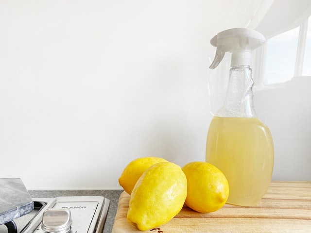

# How to sanitize XML tags in Rails

<!--- Photo by Crema Joe on Unsplash --->



Once I noticed that we can sanitize XML-tags using [rails-html-sanitizer](https://github.com/rails/rails-html-sanitizer) and [loofah](https://github.com/flavorjones/loofah) gems. And I want to share the knowledge.

For example, imagine the task, we have a string that contains some HTML-tags.

```ruby
html_string = <<-STR
<p>
  <span>some text is here</span>
  <a></a>
</p>
STR
```

We want to sanitize the string, but don't delete `` tag.

```ruby
scrubber = Rails::Html::PermitScrubber.new
scrubber.tags = ['img']
scrubber.attributes = ['src']
html_fragment = Loofah.fragment(html_string)
html_fragment.scrub!(scrubber)

puts html_fragment.to_s
```

Of course, it works perfectly, and our result is here.

```ruby
# some text is here
# 
```

Unfortunately, it won't work with tags which name contains symbols `:`, `-`. XML-tags often contain those symbols.

```ruby
xml_string = <<-STR
<item>
  <title>A Life in Russia</title>
  <description>What do you knot about Russia?</description>
  <dc:creator>Sasha Troianovski</dc:creator>
  <media:content height="150" medium="image" url="https://static.worldtimes.com/images/2099/02/13/world/some_photo.jpg" width="151"/>
  <media:credit>Sasha Troianovski for The World Times</media:credit>
  <media:description>Amazing travel to Russia</media:description>
</item>
STR
```

For example, we want to sanitize a new string, but we need to keep <media:content>, <media:credit> and <media:description> tags.

```ruby
scrubber = Rails::Html::PermitScrubber.new
scrubber.tags = ['media:content', 'media:credit', 'media:description']
html_fragment = Loofah.fragment(xml_string)
html_fragment.scrub!(scrubber)

puts html_fragment.to_s
```

Unfortunately, it doesn't work properly, and our result is.

```ruby
# A Life in Russia
# What do you knot about Russia?
# Sasha Troianovski

# Sasha Troianovski for The World Times
# Amazing travel to Russia
```

How to solve the problem? `Loofah` is able to work with XML but we have to tune up a parser and use `.xml_fragment` instead of `.fragment`.

```ruby
scrubber = Rails::Html::PermitScrubber.new
scrubber.tags = ['media:content', 'media:credit', 'media:description']
xml_fragment = Loofah.xml_fragment(xml_string)
xml_fragment.scrub!(scrubber)

puts xml_fragment.to_s
```

And here is our result.

```ruby
# A Life in Russia
# What do you knot about Russia?
# Sasha Troianovski
# <media:content height="150" width="151"/>
# <media:credit>Sasha Troianovski for The World Times</media:credit>
# <media:description>Amazing travel to Russia</media:description>
```

It works perfectly.

[dev.to](https://dev.to/kopylov_vlad/how-to-sanitize-xml-tags-in-rails-4iid)
