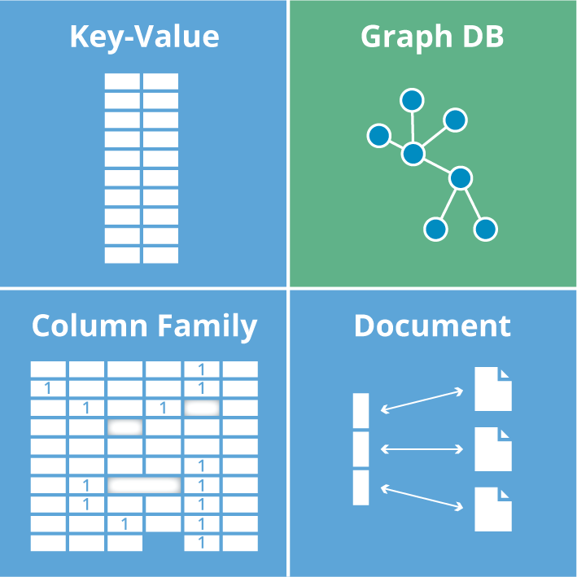
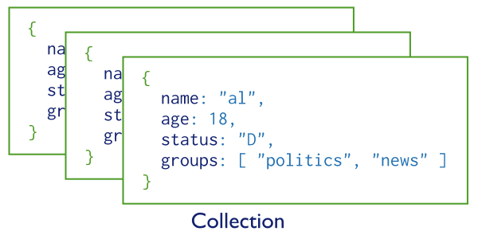
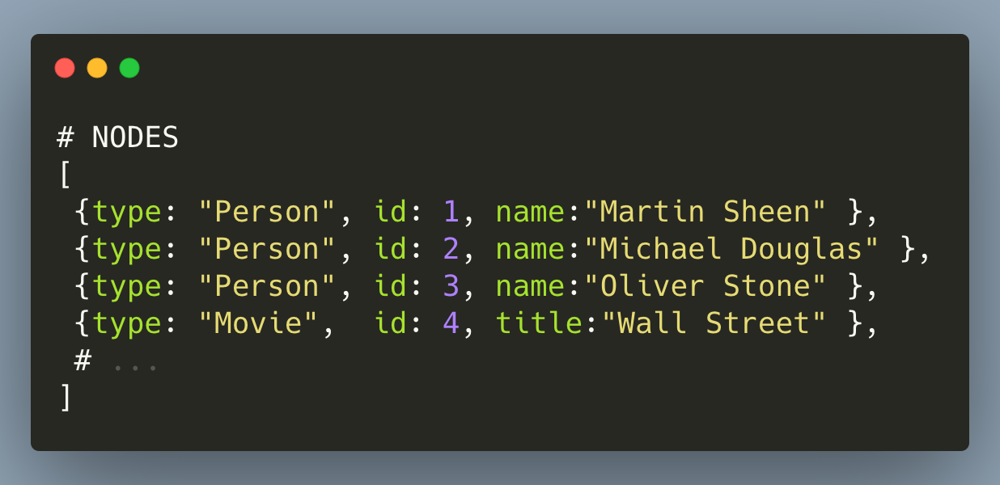
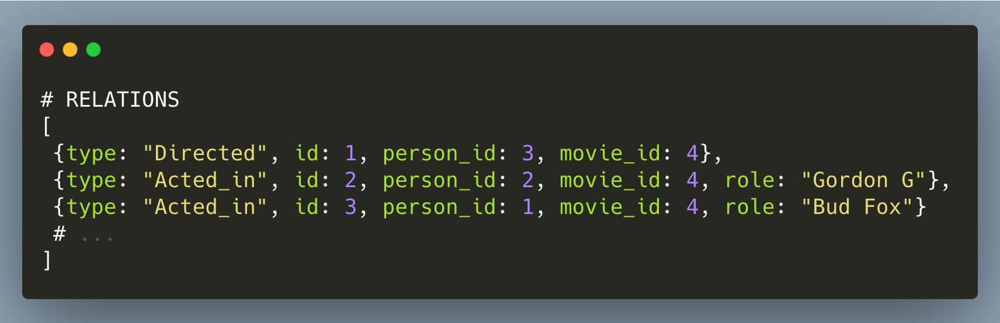

# Какую базу данных выбрать под свой проект

<!--- Photo by <a href="https://unsplash.com/@tingeyinjurylawfirm?utm_source=unsplash&utm_medium=referral&utm_content=creditCopyText">Tingey Injury Law Firm</a> on <a href="https://unsplash.com/?utm_source=unsplash&utm_medium=referral&utm_content=creditCopyText">Unsplash</a> --->

После прочтения [предыдущего поста](https://kopilov-vlad.medium.com/%D0%BE%D1%82%D0%BA%D1%83%D0%B4%D0%B0-%D1%82%D0%B0%D0%BA%D0%BE%D0%B9-%D0%B7%D0%BE%D0%BE%D0%BF%D0%B0%D1%80%D0%BA-%D0%B1%D0%B0%D0%B7-%D0%B4%D0%B0%D0%BD%D0%BD%D1%8B%D1%85-%D0%B8%D0%BB%D0%B8-%D0%B2%D0%B2%D0%B5%D0%B4%D0%B5%D0%BD%D0%B8%D0%B5-%D0%B2-%D1%80%D0%B0%D0%B7%D0%BD%D0%BE%D0%BE%D0%B1%D1%80%D0%B0%D0%B7%D0%B8%D0%B5-%D0%B1%D0%B4-a99a0fc2371c) у меня спрашивали советы какую базу данных выбрать под тот или иной проект, поэтому я решил написать еще одну статью, но акцентировать внимание не на историческую часть, а на реализацию той или иной БД и дать практические советы что же них выбрать.

## TL;DR

- Если ты пишешь мини приложение — выбирай key-value БД (redis)
- Если нужно быстро сделать прототип — документоориентированная БД (mongoDB)
- Социальная сеть — тебе подойдет графовая БД (neo4j)
- Посчитать статистику — документоориентированная БД (mongoDB)
- Для всего остального есть SQL

## Техническая часть

База данных — это всего лишь инструмент, для решения своей задачи: не только хранить информацию, но и давать интерфейс для манипулирования. Есть два больших семейства БД: SQL и NoSQL. Разберем их подробнее.

### SQL

SQL, то есть реляционные БД — это такой эксель среди баз данных.
Почему? — Потому что данные в этих БД хранятся в табличках как в экселе. В одной БД может быть несколько табличек, как в одном эксельном файле и данные из одной таблицы могут иметь ссылки на другие таблицы. Поэтому когда вы услышал SQL то можете смело представлять себе эксель.

Такие БД активно используются с 80-х годов. Это уже зрелая и надежная технология с огромной методологической базой.

SQL развивался в первую очередь как стандарт. Если вы раньше слышали про такие БД как MySQL, SQLite, MariaDB — то знайте что это все реализации SQL и отличия только в нюансах.

### NoSQL

<!--- Picture from https://neo4j.com  ---->

NoSQL базы подходят по-другому к вопросу как хранить данные, и по названию ясно что данные хранятся не в таблице.

Есть следующие семейства которые по-разному хранят данные:

- Key-value хранилища (ключ-значения)
- Документноориентированные БД
- Графовые базы данных

#### Key-value хранилища

Про них можно сказать что данные хранятся в одном глобальном JSON’е в которых вы записываете данные по ключу и по этому же ключу читаете информацию.

Преимущество такой реализации — это скорость работы т.к. O-большое по поиску в хеше — это 1. Она очень быстро находит данные и записывает их. Плюс она наименее требовательная к ресурсам. Из-за этого она хорошо подходят под небольшие проекты.

Самая популярная база данных данного семейста — [Redis](https://redis.io/)

#### Документноориентированные БД

Если базы данных предыдущего семейства хранили данные в одном глобальном JSON’е, тот тут у нас есть массив в который мы может складывать JSON-объекты. Такие массивы тут называются коллекциями.

<!--- Picture from https://docs.mongodb.com --->

Вы сохраняете в коллекцию JSON’ы с произвольными наборами данных и достаете данные из этой коллекции. JSON — это очень гибкая структура данных которая может быть сколько угодно вложенная по глубине. Плюс, не проблема добавить или удалить ключик из объекта в любой момент времени.

Преимущества данного подхода — гибкость. У нас нет строгой схемы данных, как например в таблице, поэтому вы можете хранить в одной коллекции объекты с разнообразными ключами.

Дополнительно на уровне БД у вас есть простой, но мощный функционал подсчета статистики по вашим данных — достаточно пройтись по массиву с помощью `map/filter/reduce`

Самая популярная база данных данного семейста — [MongoDB](https://www.mongodb.com/)

#### Графовые базы данных

Как видно по названию, такие БД хранят графы. Но что же такое граф? — это очень математическая структура данных, и её лучше разбирать на примере.

Любая соц-сеть где куча людей подписываются друг на друга, добавляют друг друга в друзья и также могут являться друг другу родственниками — идеальный пример графа. Любая карта — это тоже граф. И задача нахождения самого короткого пути из точки A в точку B — это типичная задача из теории графов.

<!--- Picture from https://www.freecodecamp.org --->

Как уже понятно, такие БД идеальны для написания социальной сети где между объектами большое кол-во связей.

Структура хранения данных — следующая. Представьте что теперь у нас есть целых два массива в который мы складываем наши JSON’ы. Но в один мы складываем только данные с информацией обо всех объектов нашей системы (так называемые ноды), а во второй информацию о связей между объектами.

Для понимания тут хорошо подойдет пример: мы пишем сервис с информацией о фильмах, как Кинописк. У нас будут данные о фильмах и о том какие люди занимались его созданием.

- В первый массив мы сохраняем данные обо всех объектов т.е. про фильмы и людей что принимали участие (режиссеров, актеров, операторов и прочее)
- Во второй массив мы сохраняем связи — информацию кто был режиссером какого фильма, кто был актером, а кто оператором

Такая структура удобная тем что мы в одном запросе к БД достаем сразу все объекты которые нам интересны и связи: например при запросе, дай мне всех людей с кем работал этот режиссер.

Кроме соц-сетей, графовые БД хороши для реализацией систем рекомендаций т.к. нам удобно обходить графы и находить самые короткие маршруты между нодами. Самая популярная база данных данного семейства — [Neo4J](https://neo4j.com/)

## Практические советы

А теперь к практике

**Кейс**\_**: Мы пишем маленькое приложении чтобы выводить какую то одну информацию пользователям (курсы валют, погода в их родном городе и прочее)
**Что взять**: key-value БД(redis)
**Почему\*\*: В данном кейсе достаточно использовать примитивные структуры данных. Положили строки/числа в массив и сохранил массив в БД по ключу — удобно

**Кейс**: Маленькое приложение чтобы трекать информацию (кол-во пройденных шагов, кол-во выпитых стаканов воды или что-то другое)
**Что взять**: key-value БД (redis)
**Почему**: смотри выше

**Кейс**: Наше приложение будет собирать данные из разнообразных источников, делает агрегацию по ним чтобы показать пользователям красивые дашборды, графики и прочее
**Что взять**: Документноориентированные БД (mongoDB)
**Почему**: Идеальна чтобы хранить в одной коллекции разнообразные данные. Так как данные хранятся не в таблице, хеши могут содержать разные ключи. Дополнительно поддержка функционала `map/filter/reduce` позволяет делать агрегации на уровне БД, а не приложения.

**Кейс**: Мы до конца не понимаем что мы хотим реализовывать, очень смутная цель, но мы уверены что за одну неделю напишем прототип и потом скорее всего все переделаем. Нам нужна гибкость для изменений структуры данных
**Что взять**: Документноориентированные БД (mongoDB)
**Почему**: Так как у нас нет строгой схемы данных, мы может легко менять информацию о наших объектов (добавлять и удалять ключи из JSON’а). Благодаря этой гибкости наши мы можем свободно и быстро менять данные.

**Кейс**: Мы пишем масштабное приложении где у каждого элемента, будет огромное кол-во связей. Функционал очень похож на типичную соц-сеть
**Что взять**: графовые базы данных (neo4j)
**Почему**: В графовых БД очень легко манипулировать связями между объектами в нашей БД

**Кейс**: Мы пишем систему рекомендации. Нам нужно записывать максимальное кол-во связей между и находить связи между ними
**Что взять**: графовые базы данных (neo4j)
**Почему**: Идеальная БД чтобы строить графы и находить короткие маршруты между ними

**Кейс**: Мы идеально представляем как записать наши данные в табличку в экселе. Или же мы хотите углубится в теорию и методологию реализаций баз данных
**Что взять**: Любую реализацию SQL
**Почему**: К вашим услугам огромное кол-во проработанной методологии, учебников и статей.

## Заключение

Вот и все, надеюсь что этой статьей я ответил на вопрос и она оказалась полезной.

[medium](https://kopilov-vlad.medium.com/какую-базу-данных-выбрать-под-свой-проект-264a265db188)
