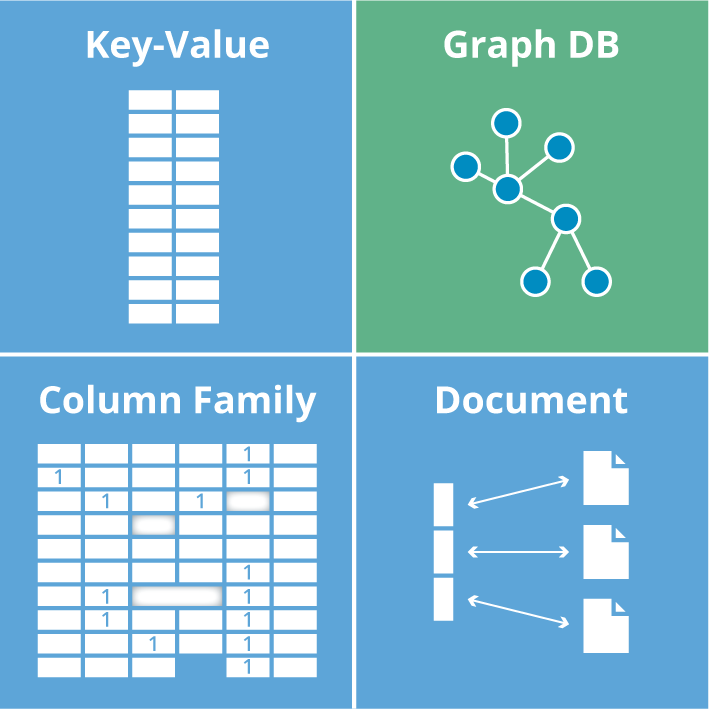

# Which database to choose for your project

<!--- Photo by <a href="https://unsplash.com/@markuswinkler?utm_source=unsplash&utm_medium=referral&utm_content=creditCopyText">Markus Winkler</a> on <a href="https://unsplash.com/s/photos/think?utm_source=unsplash&utm_medium=referral&utm_content=creditCopyText">Unsplash</a>
 --->

From time to time, workmates ask me for choosing the appropriate database for a new project. Then I decided to write an article to share knowledge with other people.

## TL;DR

* You are going to write a tiny application - use a key-value database (redis)
* You want to create MVP as fast as you can - the best choice is a document-oriented database (mongoDB)
* You want to write brand new social network - use a graph database (neo4j)
* You are going to write an app to calculate data and show statistic - better to use a document-oriented database (mongoDB)
* Otherwise - use SQL database

## Theory

Any database is just a tool to collect and store data. It provides API to allow you to manipulate data. There are two big database families: SQL and NoSQL. Let’s talk more about them.

### SQL

SQL means relational databases. What is it? Just imagine Microsoft Excel. It’s the best representation for SQL database because it stores data in tables and sheets as in one `.xlsx` file.

People use SQL since the 80s. It’s a mature and reliable technology. Also, SQL is a standard for databases, therefore there are a lot of implementations of it. I have no doubt that you have heard about MySQL, SQLite, MariaDB, etc. They are all just implementations of SQL and support all basic features.

### NoSQL

<!--- Picture from https://neo4j.com  ---->

There are NoSQL solutions. They follow different approaches how to store data because they don’t use tables and sheets. There are various NoSQL families:

* Key-value databases
* Document-oriented databases
* Graph databases

#### Key-value databases

The database stores data in one global namespace. You can imagine that the database stores any data in one global JSON object. It holds data with the given key and returns the value associated with the given key.

The benefits of key-value storage are speed and simplicity. They are very fast because accessing an element in a hash table is O(1). The databases are tiny and very fast.

The most popular key-value database is [Redis](https://redis.io/).

#### Document-oriented databases

The previous type of databases stores data in one global hash table. Document-oriented databases store data in an array of JSON. We can call it a collection.

<!--- Picture from https://docs.mongodb.com --->

The benefit of key-value storage is flexibility. There is no strict data scheme as in SQL databases. Consequently, we can store objects with any keys in one collection and each object can contain unique keys.

Also, document-oriented databases, such as mongoDB provides us with powerful functionality of data aggregation (`map/filter/redice` in one collection). If you want to calculate statistical data in order to show charts and dashboards, document-oriented database is a good choice.

The most popular key-value database is [mongoDB](https://www.mongodb.com/).

#### Graph databases

As the name suggests, the databases are created to manipulate graph data structure. A graph is an abstract data type, it’s better to describe it with an example.

Any social network is a good example of the graph. The application where users add each other to a friends list, subscribe and follow each other, etc is the best example of a graph because the application has a lot of relations between users. A graph database is the best choice for an application with a huge amount of relations.

<!--- Picture from https://www.freecodecamp.org --->

How the database stores the data?
The previous type of databases stores data in one array (a collection of JSON objects). There are we have two collections. The database collects data about all entities in one collection and data about all relations in another collection.

For example, we are going to write an IMDb clone. We will store data about films and people who participated in films. In one collection database will save data about all our entities (films and people). It will save data about all relations (information about who was an actor or a director in a film) in another collection. The data structure suits the best with graphs and we can easily have access to entities and all their relations.

Example of collection of entities:

Example of collection of relations

The most popular key-value database is [neo4j](https://neo4j.com/)

## Practical advice

There is practical advice on what database to use. There are several cases, you can choose one that suits you the best.

- **case**: We are going to write a tiny application that will show users any information (weather, exchange rates, number of days without accident etc)
- **database**: key-value DB (Redis)
- **why**: In this case, we will operate by primitive data type. A key-value database is enough for us.
 

- **case**: We plan to write an app for tracking one type of daily user’s activities (steps, the daily amount of glass of water, etc)
- **database**: key-value DB (Redis)
- **why**: look at the previous case
 

- **case**: We want to create an application that will collect data from different sources. Then it will aggregate the data to show charts and dashboards.
- **database**: document-oriented DB (mongoDB)
- **why**: The database is best suited to store different data-structure in one collection. It provides a powerful aggregation feature and we can calculate data just with `map/filter/reduce`.
 

- **case**: The requirements of the project are vague and unclear, but we are fire sure that we have to release the first MVP as fast as we can. And after that, we most probably will reimplement it from scratch.
- **database**: document-oriented DB (mongoDB)
- **why**: The database doesn’t have a strict data schema. It allows you to store not consistent data in one collection. It’s a killer feature for a fast launch.
 

- **case**: We are going to write an application to store a huge amount of entities with a lot of relations. The application is similar to a social network
- **database**: graph DB (neo4j)
- **why**: Only graph DBs suit the best for data structure with a lot of relations. It won’t be difficult to manipulate entities and relations in any graph DB.
 

- **case**: We can clearly imagine how to store our data in a single excel file or we want to be deeply immersed in database design.
- **database**: any SQL database
- **why**: There is a huge amount of methodology about
database design, data modelling, query optimization, database normalization, etc. Its mature and reliable technology, therefore, a lot of tutorials, manuals and books are available.
 

[dev.to](https://dev.to/kopylov_vlad/which-database-to-choose-for-your-project-2p2g)
