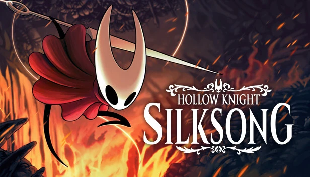
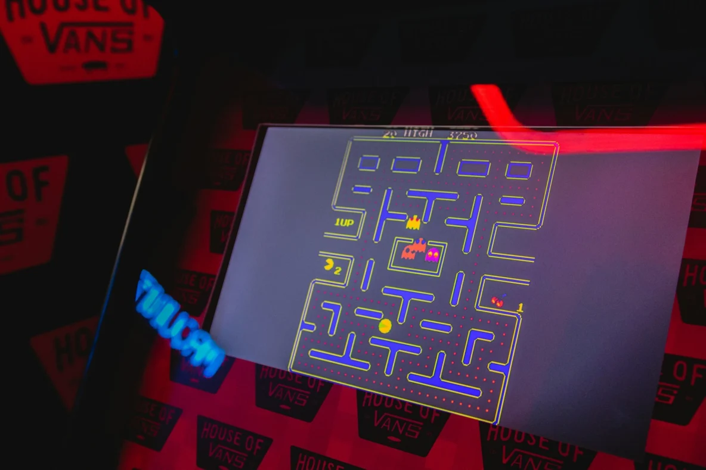
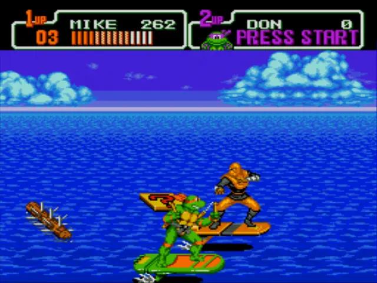
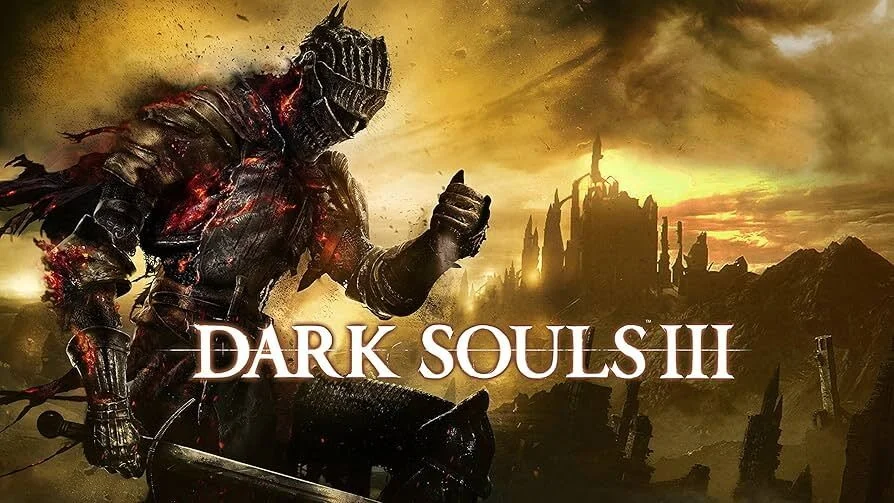
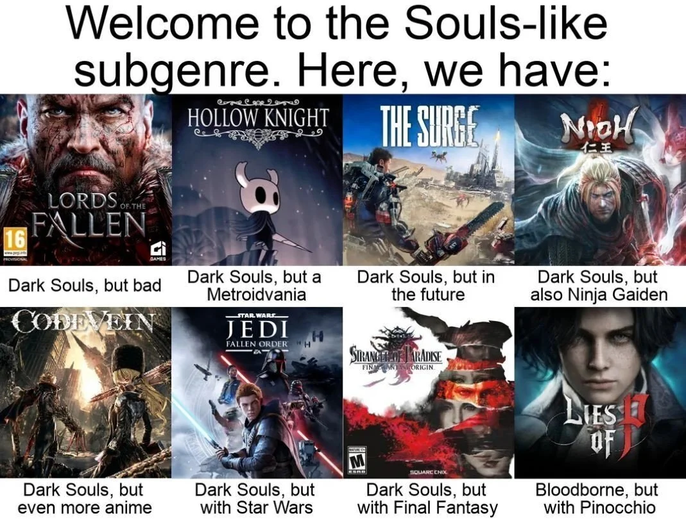
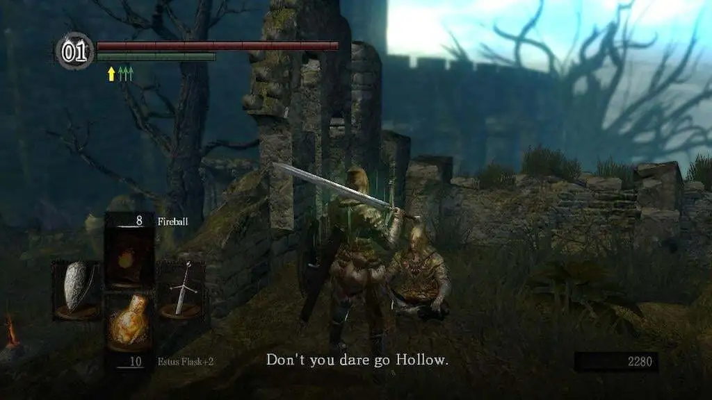

# Долгий дофамин: чему нас учат сложные игры

## [Введение]

Мой запланированный отпуск и выход Hollow Knight: Silksong - превратилось в событие, которое вряд ли можно считать простым совпадением. Я, как фанат первой части и преданный исследователь Халлоунеста, купил Silksong и пошел исследовать мир Фарлума. С первых биомов игры стало ясно, что даже для фанатов первой части, она оказалась сложной игрой. Здесь нет уступок, нет облегченного пути и режима для казуалов. Каждая схватка требует внимания и сосредоточенности. Это заставило меня задуматься о самом феномене сложных игр. Являются ли они чем то большим чем развлечением? Так ли они бесполезно сжирают время, как кажутся на первый взгляд, или в них скрыто что-то большее?

## [Эволюция сложности в играх]

Начну с краткой историей развития видеоигр, по которой мы пройдемся большими мазками. Уверен, что среди читателей будут люди, которые больше в теме и увидят мои недочеты, но я специально все упрощу и быстро пробегу. Нам больше важна не историчность, а заметить как они отражали дух времени

Первые массовые видеоигры появились на аркадных автоматах, которые вы наверняка застали в торговых центрах, хоть у нас это развлечение было менее массовым, чем на западе. По железу автоматы были слабые и дорогие, что породило ряд особенностей. Из-за ограничений железа, сами игры были короткие, сюжета как такого не было. Чтобы было интересно играть, эти игры делались непростые, а порой вообще бесконечно повторяющиеся пока хватает сил и внимания игрока. Чтобы заработать на этих автоматов, за попытку поиграть брали монету. Монета - это была настоящая ставка, цена за попытку, которую платили игроки. А чтобы стимулировать людей играть снова, в конце игры была таблица рекордов как зал славы конкретного автомата. Игрок, который продержался дольше всех мог внести туда свое имя. Это стимулировало людей платить, проходить, побивать рекорды других, а бизнес видеоигр развивался. Хорошие примеры эпохи: Packman, Space Invaders, Street Fighter

Позже появились домашние приставки. Игры, как развлечение, перешли с экранов автоматов на экраны домашних телевизоров, но технические ограничения остались. Долгое время игры на приставках были клонами игр с автоматов - те же коротенькие сложные игры, которые можно было пройти за один вечер. Появился больший акцент на кооперативные прохождения вместе с друзьями. Хороший пример: TMNT, Battletoads, DoubleDragons, Contra

Смотря на сложность некоторых консольных игры я удивляюсь, что они воспринимались как детские и что нам давали в это играть. Ведь это разрабатывалось взрослыми, для таких же взрослых любителей аркад. Играть в приставку в 90-х больше походило на экзамен, чем на развлечение. В те годы ребенок мог и джойстик сломал от отчаянья, что не смог пройти очередной сложный уровень в Battletoads

Рынок консолей развивался, железо выходило мощнее, поэтому видеоигры двигались дальше и их акцент сместился на игры для одного игрока с более проработанным сюжетом. Это рождение эпохи нарратива в играх. Появляется функционал сохранения, что позволяет делать более долгие игры и помогает игроку не начинать все с начала. Видеоигры из развлечения становятся больше предметом искусства: продуманные миры, сюжеты, персонажи. Игра рассказывает игроку сюжет как книга или фильм - игровой театр на вашем экране. Игрок уже играет в игру как в интерактивный фильм, проживает не просто уровень, а целую историю. Апогеем этого всего стала адаптивная сложность игр, когда если игра понимает что игрок не справляется с каким-то уровнем, то специально снижает сложность (как в Resident Evil). Вектор игры с испытания сместился на комфортный просмотр

Современные возможности железа и желание сделать игру наиболее массовым породили те игры, которые больше похожи на интерактивные фильмы/приключения нежели на игры. На игры где игровые видео между уровнями занимают все больше и больше времени

## [Beat’em up]

Итак, мы заметили как суть видеоигр менялась со временем от испытания до спокойного развлечения на вечер. Поздние автоматы породили интересный жанр Beat’em up, а домашние консоли подарили ему золотые годы из-за чего он сильно повлиял на игры. Для непосвященного, любая игра на консоле выглядела как beat’em up. Характерные особенности таких игр:

- нет сюжета как такого, тебе надо освободить принцессу/брата, отомстить
- наш герой по силе сильнее среднего врага, которого он встретит на пути
- поэтому на героя нападают толпы противников, а он раскидывает их направо и налево
- в игре есть комбо за атаки без урона и игра всячески поощряет набивание этих комбо
- кооперативные прохождения вместе с друзьями
- однотипные коридорные уровни и линейность их прохождения

Это дает ритм, зрелище, демонстрацию силы и позволяет отключать голову после рабочего дня и получать удовольствия от карнавала ударов и ритма боя. Beat’em up игры выходят и сейчас: как ремастеринги старых игры (TMNT shredder's revenge) и как ностальгия по эпохе первых консолей (Castle Crashers, Shank). Как по мне, beat’em up стал символом эпохи массового удовольствия, и даже в современных играх его влияние чувствуется

## [Рождение souls-like игр и их особенности]

Интересный виток развития случился в 2011 году. Когда вся индустрия шла к массовости и упрощению, выходит игра от Миядзаки, что начинает целое движение в виде souls-like игр. В чем особенность таких игр:

- эти игры делают упор на сложность и они намеренно сложные
- в отличие от beat’em up, герой слабее, чем персонажи вокруг него
- на тебя нападают не сразу 10 противников, а обычно 1 на 1 или 2 на 1, но даже эти встречи - настоящие дуэли
- нет комбо, как феномена
- иногда там нет блока как такового
- сложные боссы, которого на чистом напоре не пройдешь
- в этих играх существует прокачка, но больше как способ подтянуть игрока под более сложное окружение.
- мало точек сохранения. Нельзя сохранятся на каждом шагу.
- если умер, то теряешь все деньги и должен добежать до места смерти чтобы забрать их
- нелинейность сюжета позволяет заблудится в игре и попасть на локацию, где быть игроку еще рано по силам

Плюс, насчет нарратива в них можно выделить следующие особенности:

- депрессивные локации, мир в руинах, смысл которого утрачен
- вдохновение готическим средневековым стилем
- отсутствующей сюжетный отыгрыш, где сюжет не объясняют, а игрок его выхватываешь по кусочкам, по обрывкам фраз, как археолог

Порой такие игры называют бесконечным страданием тк из-за их сложности смертей много, а цена ошибки очень высока. Но благодаря ним, игра снова стала испытанием, как было в аркадном автомате. Внезапно, против законов массовых игр, такие нишевые игры стали культурным феноменом. Серия игры Dark Souls от Миядзаки стала культовой и повлияла на другие игры

## [Феномен их популярности]

В чем же феномен их популярности? В том, что они сложные, но они проходимые. Игры снова стали вызовом. В них не игрок прокачивает своего виртуального персонажа, а прокачивает сам себя, свое внимание, терпение, характер. Он наблюдает за игровым миром, наблюдает за движениями врагов, предугадывает их атаки и как на каждую атаку отвечать

Плюс, это совпало с эпохой коротких видео и других стимуляторов короткого удовольствия тем, что в отличие от них, дает игроку долгий дофамин. Когда после 100 попыток, наконец-то победил босса - это дает кайф больше, чем от просмотра 100 коротких видео. Порой и встречи с рядовым противником по напряжению как встречи с мини-боссами. Может быть, именно в этой честной и тяжёлой радости скрывается ответ на вопрос, почему столько людей пошли добровольно на такой путь страдания

## [Что они развивают. Чему учат]

Удивительно, но порой натыкаешься на материалы где игроки в souls-like игры делятся тем, чем эти игры помогли им в чем-то. Кому-то они помогли в непростой период жизни, а кого-то вытащили из депрессии. Достаточно поискать заголовок «dark souls saved my life». Но почему souls-like игры помогают пережить депрессию или трудные периоды в жизни? Чему они учат и какой навык прокачивают?

Ответ - игра учит тебя учиться на своих ошибках. Ты умираешь и с каждой новой попытки у тебя что-то получается лучше: увернутся, парировать атаку, пробежать, попрыгать на платформах. [Это прокачивает](https://hsedesign.ru/project/4368f1ee2a054da0bf4a76051a26d125): настойчивость, терпение, толерантность к фрустрации, веру в собственную эффективность. Учит не сдаваться, спокойно относится к неудачам. Благодаря, самому эффекту долгого дофамина в таких играх, наш мозг укрепляет нейронные цепи долгосрочной мотивации, повышает способность выдерживать усилие и откладывать удовольствие

Если мы углубимся больше и почитаем материалы в интернете, то мы наткнемся такой термин как [Self-efficacy](https://en.wikipedia.org/wiki/Self-efficacy). Это - самоэффективность, вера в себя, в эффективность собственных действий и ожидания успеха от их реализации (не путать с самооценкой). То самое чувство, которое мы испытываем когда наконец-то стали понимать какие-то сложные вещи, которые раньше нам не давались. Как раз, есть исследования, что слабая вера в себя приводит к высокому уровню тревожности, развитию суицидальных мыслей и депрессии, а высокая снижает. После опыта в souls-like играх, любая сложная задача не кажется непреодолимой, а скорее выполняет роль испытания, которое нам требуется попытаться пройти

Это контринтуитивно, но хардкорные игры помогают вашей кукухи не улетать далеко и надолго. Souls-like игры - не мазохизм, а альтернатива поверхностному удовольствию. Эти игры учат мозг работать с самим процессом преодоления трудностей

## [Личные инсайты]

На мой взгляд самое ценное, что мы можем получить от искусства - это инсайты. Например, играя в Hollow Knight я впервые научился выжиданию. Сколько я ни проходил Beat’em up игры, я постоянно делал это на какой-то удаче и на одних и тех же повторяющихся ударов. В HK я столкнулся с тем, что на одной удаче и без чтения противника ты не вывезешь. HK научил меня работать с таймингами противника, научил меня строить движения/тактику от защиты. Порой в жизни я в чем-то себя останавливал с мыслью «я сейчас атакую», а лучше подождать

Самое интересное - заметить как часто вы проходите через какую-то сложность по жизни. Я работаю в IT и феномен souls-like игр как раз пересекаются с самым [востребованным навыком для программиста](https://habr.com/ru/companies/domclick/articles/569062/) - это умение выдерживать фрустрацию, возникающую от преодоления когнитивной сложности. Тот-же самый навык нужен и студенту и ученому. В souls-like играх вы сталкиваетесь с той же фрустрацией, но не от когнитивной, а от механической сложности - когда необходимость выстраивать свои действия идеально точно

## [Дополнительно]

Тема, что игры - это не просто развлечения, а могут в чем-то помочь не нова. Да, видеоигры - это в первую очередь развлечение, но это не означает что во время игры наш мозг отключается. С точки зрения нарратива в играх (и вообще в искусстве), именно в тот момент когда игрок/читатель погружается в воображаемый мир и становится уверен, что на него сейчас никто не влияет, психика убирает некие защитные механизмы и в этот момент нужные мысли можно поместить в голову игрока/читателя достаточно глубоко. Как пример, есть истории людей кому моя горячо любимая Disco Elysium помогла избавится от зависимостей именно через игру в неё

Сами видеоигры имеют как минимум 4 инструмента чтобы помочь: репрезентация, восполнения опыта, отвлечение и прямая помощь. Кому интересно и хочет углубится в тему, то рекомендую видео от Джи-Джи: [https://www.youtube.com/watch?v=q9ktBUEv6YQ](https://www.youtube.com/watch?v=q9ktBUEv6YQ) Но главное помнить, что игры могут быть только частью терапии, но не самим лечением

Спасибо, что прочитали мою статью. Надеюсь, что мои мысли и наблюдения оказались полезными

[DTF](https://dtf.ru/id407445/4044733-dolgij-dofamin-kak-slozhnye-igry-razvivayut-terpenie-i-nastoychivost)
