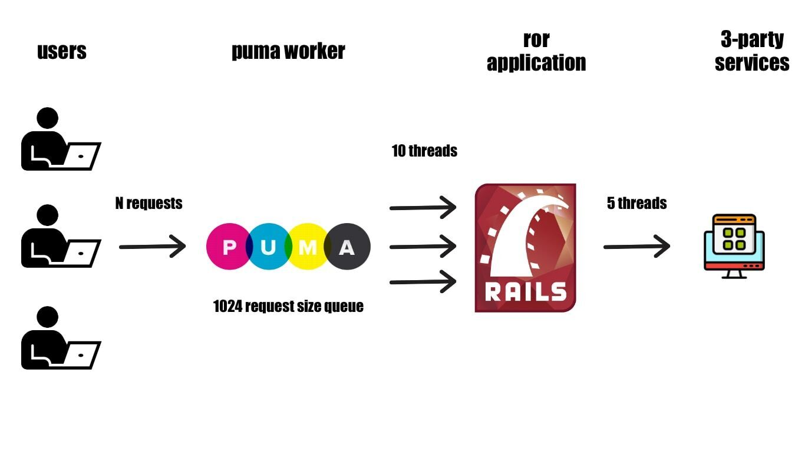

# Параллелизм в ruby 2: ограничиваем потоки


В продолжении [первой части](https://dev.to/kopylov_vlad/parallielizm-v-ruby-1-sozdaiem-potoki-2i83), где мы знакомились с тредами, пора расширять функционал. В мире микросервисов надо всегда помнить, что внешняя среда может быть нестабильной. Хорошей энтерпрайз практикой при обращении во внешний сервис является выставление таймаутов на запрос и выставление таймаутов на саму нашу ручку. Так как мы пишем серьезный агрегатор, то давайте поставим ограничение на 1 секунду для исходящего запроса и 2 секунды на ответ нашей ручки-агрегатора. В итоге ручка контроллера будет выглядеть так:

```ruby
def test3
  results = {}
  threads = URLS.map do |name, url|
    Thread.new do
      resp = Faraday.get(url) do |req|
        req.options.timeout = 1
        req.options.open_timeout = 1
      end
      results[name] = JSON.parse(resp.body)
    end
  end

  # NOTE: timeout на всю текущую ручку
  Timeout.timeout(2) do
    threads.map(&:value)
  end

  render json: { success: true, **results }, status: :ok
rescue Faraday::TimeoutError, Timeout::Error, Timeout::ExitException => e
  render json: { success: false, error: "#{e.class} -> #{e.to_s}" }, status: :gateway_timeout
end
```

Ручка работает и отдает такой же результат

```bash
$ curl  http://localhost:3000/api/v1/test3
{"success":true,"a3":{"success":true,"name":"third"},"a1":{"success":true,"name":"first"},"a2":{"success":true,"name":"second"}}%
```

Пока что наш сервис-агрегатор никаких проблем не представляет. Но представим, что со временем наш сервис увеличивается. У него появляются дополнительные ручки, он масштабируется, и становится все популярнее. Мы поднимаем больше воркеров и у него увеличивается кол-во производственных мощностей.

При данном сценарии появляется проблемы, если сервисы, к которым мы обращаемся, растут не так быстро или они сами время от времени находятся под нагрузкой. Это ситуацию мы будем сейчас симулировать. Нам нужно чтобы внешние ручки отваливались, поэтому для симуляции увеличиваем треды до 10

```bash
RAILS_ENV=production RAILS_LOG_LEVEL=debug RAILS_MAX_THREADS=10 bin/rails s -P aggregator
```

Так как просто запускать wrk не интересно, а хочется иметь лог ответа, то делаем lua-скрипт для чтения 500-х:

```lua
-- status.lua
function response(status, headers, body)
  if status >= 500 then
    io.write("\n=== 5xx ===\n")
    io.write("status: " .. status .. "\n")
    io.write(body .. "\n")
    io.write("=== /5xx ===\n")
  end
end
```

Даем нагрузку под 10 потоков

```bash
$ wrk -t2 -c10 -d30s -s status.lua --latency http://localhost:3000/api/v1/test3 > stdout.txt
Running 30s test @ http://localhost:3000/api/v1/test3
  2 threads and 10 connections
  Thread Stats   Avg      Stdev     Max   +/- Stdev
    Latency   807.54ms   58.24ms 838.73ms   97.93%
    Req/Sec     6.95      4.71    20.00     83.61%
  Latency Distribution
     50%  814.50ms
     75%  817.30ms
     90%  820.39ms
     99%  836.53ms
  368 requests in 30.08s, 179.83KB read
  Socket errors: connect 0, read 0, write 0, timeout 30
  Non-2xx or 3xx responses: 359
Requests/sec:     12.23
Transfer/sec:      5.98KB
```

Мы так и остались в пределах 15 rps, но к тому же у нас посыпались 500-е ошибки. В файле stdout.txt видны ошибки `Faraday::TimeoutError - Net::ReadTimeout with TCPSocket:(closed)`. Это потому что с увеличением кол-во клиентов мы кратно увеличиваем и нагрузку на слабенький внешний сервис.


## Добавляем thread pool

Ограничение производительности внешних сервисов не должно влиять на наше приложение, поэтому мы напишем thread pool чтобы ограничить исходящие запросы. Напишем исходящую очередь при помощи библиотеки `concurrent-ruby`

```ruby
module AppThreadPool
  # 1 worker × 5 threads
  POOL = Concurrent::FixedThreadPool.new(5) # 5 исходящих потоков
end

# хорошей практикой дождаться завершения пула при завершении процесса
Rails.application.config.after_initialize do
  at_exit do
    AppThreadPool::POOL.shutdown
    AppThreadPool::POOL.wait_for_termination(5)
  end
end
```

Переписываем нашу ручку в контроллере чтобы она использовала созданный пул для внешних запросов.

```ruby
def test4
  results = {}
  futures = URLS.transform_values do |url|
    Concurrent::Promises.future_on(::AppThreadPool::POOL) do
      resp = Faraday.get(url) do |req|
        req.options.timeout = TEST3_REQ_TIMEOUT
        req.options.open_timeout = TEST3_REQ_TIMEOUT
      end
      JSON.parse(resp.body)
    end
  end

  Timeout.timeout(TEST3_TIMEOUT) do
    results = futures.transform_values(&:value!)
  end
  render json: { success: true, **results }, status: :ok
rescue Faraday::TimeoutError, Timeout::Error, Timeout::ExitException => e
  render json: { success: false, error: "#{e.class} -> #{e.to_s}" }, status: :gateway_timeout
end
```

Проверяем работу ручку

```bash
curl http://localhost:3000/api/v1/test4
{"success":true,"a1":{"success":true,"name":"first"},"a2":{"success":true,"name":"second"},"a3":{"success":true,"name":"third"}}%
```

Снова запускаем нагрузочные тесты на 10 потоков

```bash
$ wrk -t2 -c10 -d30s -s status.lua --latency http://localhost:3000/api/v1/test4 > stdout.txt
Running 30s test @ http://localhost:3000/api/v1/test4
  2 threads and 10 connections
  Thread Stats   Avg      Stdev     Max   +/- Stdev
    Latency   857.90ms   65.56ms 991.34ms   97.39%
    Req/Sec     7.57      5.23    20.00     73.12%
  Latency Distribution
     50%  866.29ms
     75%  870.38ms
     90%  873.68ms
     99%  878.57ms
  345 requests in 30.08s, 192.71KB read
Requests/sec:     11.47
Transfer/sec:      6.41KB
```

Мы видим, что latency сохранился и пропали 500-е ошибки. Ошибок нет потому что мы не DDOS'им внешний сервис, а даем ему нагрузку по силам


## Что вообще произошло

Ручка `test3` создавала треды через `Thread.new do` и никак не ограничивала их исходящее кол-во. Наш пул `AppThreadPool::POOL` как раз ограничивал размер исходящих потоков.

Давайте подробнее посмотрим на работу внешнего сервиса под нагрузкой. Запускаем wrk

```bash
wrk -t2 -c10 -d20s --latency http://localhost:3000/api/v1/test3
```

И параллельно смотрим время ответа

```bash
$ curl -s -w "\n\ntotal: %{time_total}s\nhttp: %{http_code}\n"  http://127.0.0.1:4000/api/v1/services/second
{"success":true,"name":"second"}

total: 0.885654s
http: 200

$ curl -s -w "\n\ntotal: %{time_total}s\nhttp: %{http_code}\n"  http://127.0.0.1:4000/api/v1/services/second
{"success":true,"name":"second"}

total: 1.007139s
http: 200

$ curl -s -w "\n\ntotal: %{time_total}s\nhttp: %{http_code}\n"  http://127.0.0.1:4000/api/v1/services/second
{"success":true,"name":"second"}

total: 1.309763s
http: 200
```

Ответ от ручки `/second` стал больше чем 200ms. При этом со стороны рельсовых логов все ОК:

```plaintext
[f92379c0-0a68-43d6-bec9-7912aa2dd25d] Completed 200 OK in 205ms (Views: 0.2ms | ActiveRecord: 0.0ms (0 queries, 0 cached) | GC: 0.0ms)
[01247d48-b605-49dc-8439-7dd88b289808] Completed 200 OK in 205ms (Views: 0.1ms | ActiveRecord: 0.0ms (0 queries, 0 cached) | GC: 0.0ms)
[3a3f66d6-dd88-4c11-8cc9-8f54e82dbb9d] Completed 200 OK in 205ms (Views: 0.2ms | ActiveRecord: 0.0ms (0 queries, 0 cached) | GC: 0.0ms)
```

Это потому, что рельса трекает именно те запросы, что уже попали в нее, именно это мы и видим в логах. В настоящем развернутом приложении, перед рельсов стоит веб-сервер. В нашем случае - это puma, со своей очередью в 1024 запроса. А перед веб-сервером будет стоять как минимум один nginx. Так что если вас интересует время ответа близкое к тому, что видит пользователь, то лучше смотреть не по логам рельсы, а по логам nginx.

А какое поведение через треды? Запускаем тесты

```bash
$ wrk -t2 -c10 -d30s --latency http://localhost:3000/api/v1/test4
```

И параллельно смотрим время ответа.

```bash
$ curl -s -w "\n\ntotal: %{time_total}s\nhttp: %{http_code}\n"  http://127.0.0.1:4000/api/v1/services/second
{"success":true,"name":"second"}

total: 0.288457s
http: 200

$ curl -s -w "\n\ntotal: %{time_total}s\nhttp: %{http_code}\n"  http://127.0.0.1:4000/api/v1/services/second
{"success":true,"name":"second"}

total: 0.208960s
http: 200
```

Та как мы теперь не DDOS'им внешний сервирс, то мы видим нормальное время ответа - все в норме.

Получается, что с внешним пулом у нас следующая схема работы. У нас есть приложение. Мы запускаем 1 воркер пумы в 10 потоков. Он из своей очереди вытаскивает запросы и может передавать только 10 тредов в приложении. Но не смотря на эти 10 входящих тредов, наружу во внешний сервис приложение отдаем всего 5 потоков. В результате мы ограничиваем исходящую от нас нагрузку не в ущерб нагрузки на наш агрегатор.




## Добавляем еще энтерпрайза

Раз у нас микросервисы и внешние зависимости - значит внешний мир нестабильный. Внешние сервисы могут деградировать, но это не должно влияет на производительность нашего сервиса. Если при недоступности одного сервиса наша ручка не должна ломаться, то можно реализовать partial response

Допустим, ручка `second` не очень важна и в целом его ответом можно пренебречь, значит мы выбираем стратегию partial response на случай отказов. Для того мы можем сделать отдельный исходящий пул для ручки `second`

```ruby
module AppThreadPool
  # старый единый исходящий пул
  POOL = Concurrent::FixedThreadPool.new(5) # исходящих

  # пул для быстрых ручек (first + third)
  FAST = Concurrent::FixedThreadPool.new(6)
  # пул для медленных ручке (second)
  SLOW = Concurrent::FixedThreadPool.new(3)
end
```

Напишем код в контроллере чтобы проверить какое будет поведение с одним и с двумя пулами

```ruby
# переместим slow в конце тк он наименее ценный
URLS2 = {
  a1: ['http://localhost:4000/api/v1/services/first',  :fast],
  a3: ['http://localhost:4000/api/v1/services/third',  :fast],
  a2: ['http://localhost:4000/api/v1/services/second', :slow]
}

def test5
  deadline = Concurrent.monotonic_time + 1.2 # дедлайн всей ручки агрегатора (partial response)
  futures = URLS2.transform_values do |(url, kind)|
    if params[:pool] == '1' # будем выбирать 1 или 2 пула по get-параметру
      pool = AppThreadPool::POOL
    else
      pool = (kind == :slow) ? AppThreadPool::SLOW : AppThreadPool::FAST
    end

    Concurrent::Promises.future_on(pool) do
      resp = Faraday.get(url) do |req|
        req.options.timeout = 2.0 # таймаут на запрос
        req.options.open_timeout = 0.1
      end
      { ok: true, data: JSON.parse(resp.body) }
    rescue Faraday::Error => e
      { ok: false, error: "#{e.class}: #{e.message}" }
    rescue StandardError => e
      { ok: false, error: "#{e.class}: #{e.message}" }
    end
  end

  results = {}
  futures.each do |name, f|
    remaining = deadline - Concurrent.monotonic_time
    if remaining <= 0
      results[name] = { ok: false, error: "deadline_exceeded" }
      next
    end
    # ждём конкретный future не дольше оставшегося времени
    v = f.value(remaining)
    results[name] = v || { ok: false, error: "deadline_exceeded" }
  end

  render json: { success: true, partial: results.any? { |_k, v| v[:ok] == false }, results: results }, status: :ok
end
```

Запускам наш сервис агрегатор

```bash
RAILS_ENV=production RAILS_LOG_LEVEL=debug RAILS_MAX_THREADS=10 bin/rails s -P aggregator
```

Для первого эксперимента убеждаемся, что ручка отвечает за 0.2 секунды и она стабильная

```ruby
def second
  sleep(0.2)
  render json: { success: true, name: __method__ }, status: :ok
end
```

Тестируем ответ когда все хорошо

```bash
# один пул
$ wrk -t2 -c10 -d30s --latency  http://localhost:3000/api/v1/test5\?pool\=1
Running 30s test @ http://localhost:3000/api/v1/test5?pool=1
  2 threads and 10 connections
  Thread Stats   Avg      Stdev     Max   +/- Stdev
    Latency   857.51ms   62.36ms 973.93ms   97.39%
    Req/Sec     6.68      3.03    10.00     54.34%
  Latency Distribution
     50%  865.51ms
     75%  868.25ms
     90%  871.34ms
     99%  876.28ms
  345 requests in 30.09s, 221.35KB read
Requests/sec:     11.47
Transfer/sec:      7.36KB

# два пула
$ wrk -t2 -c10 -d30s --latency  http://localhost:3000/api/v1/test5
Running 30s test @ http://localhost:3000/api/v1/test5
  2 threads and 10 connections
  Thread Stats   Avg      Stdev     Max   +/- Stdev
    Latency   861.79ms   71.23ms   1.20s    94.19%
    Req/Sec     9.13      5.87    20.00     59.23%
  Latency Distribution
     50%  861.89ms
     75%  868.70ms
     90%  877.96ms
     99%    1.08s
  344 requests in 30.08s, 220.71KB read
Requests/sec:     11.44
Transfer/sec:      7.34KB
```

Итоги - хуже не стало, но и лучше стать не могло.

### Нестабильная ручка - один пул

Следующих эксперимент. Делаем ручку нестабильной. Пусть у `second` постоянно будет таймаут

```ruby
def second
  sleep(1.3)
  render json: { success: true, name: __method__ }, status: :ok
end
```

Пишем lua-скрипт для чтения боди, чтобы точно знать что у нас отвалилось при нестабильной ручке `second`

```lua
-- body.lua
function response(status, headers, body)
  io.write("status: " .. status .. " body: " .. body .. "\n")
end
```

тестируем через wrk один пул

```bash
$ wrk -t2 -c10 -d30s -s body.lua --latency http://localhost:3000/api/v1/test5\?pool\=1 > test1.txt
$ tail -n 11 test1.txt
  Thread Stats   Avg      Stdev     Max   +/- Stdev
    Latency     1.21s     5.27ms   1.23s    80.42%
    Req/Sec    12.31     16.55    40.00     73.85%
  Latency Distribution
     50%    1.21s
     75%    1.22s
     90%    1.22s
     99%    1.23s
  240 requests in 30.08s, 146.58KB read
Requests/sec:      7.98
Transfer/sec:      4.87KB
```

По итогу latency упирается в потолок, что предсказуемо

Во время запуска wrk можно отправить запросы на ручки second и first и заметить, что во время нагрузки, время ответа у них увеличилось

```bash
$ curl -s -w "\n\ntotal: %{time_total}s\nhttp: %{http_code}\n"  http://127.0.0.1:4000/api/v1/services/second
{"success":true,"name":"second"}

total: 1.406698s
http: 200

$ curl -s -w "\n\ntotal: %{time_total}s\nhttp: %{http_code}\n"  http://127.0.0.1:4000/api/v1/services/first
{"success":true,"name":"first"}

total: 0.563120s
http: 200

$ curl -s -w "\n\ntotal: %{time_total}s\nhttp: %{http_code}\n"  http://127.0.0.1:4000/api/v1/services/first
{"success":true,"name":"first"}

total: 0.209376s
http: 200
```

Итого: latency под таймаут, rps под 7 запросов. Давайте посмотрим на ответы и увидим что отваливается. В файле test1.txt строки типо типо

```json
status: 200 body: {"success":true,"partial":false,"results":{"a1":{"ok":true,"data":{"success":true,"name":"first"}},"a3":{"ok":true,"data":{"success":true,"name":"third"}},"a2":{"ok":true,"data":{"success":true,"name":"second"}}}}
status: 200 body: {"success":true,"partial":true,"results":{"a1":{"ok":false,"error":"deadline_exceeded"},"a3":{"ok":false,"error":"deadline_exceeded"},"a2":{"ok":false,"error":"deadline_exceeded"}}}
```

Если погрепать, то мы увидим что отваливаются почти все ручки

```bash
$ grep '"partial":false' test1.txt| wc -l
  0
# 0 полных ответов

$ grep '"partial":true' test1.txt| wc -l
  240
# 236 неполных ответа

$ grep '"a1":{"ok":false' test1.txt|wc -l
  235
$ grep '"a2":{"ok":false' test1.txt|wc -l
  240
$ grep '"a3":{"ok":false' test1.txt|wc -l
  235
```

### Нестабильная ручка - два пула


Пробуем два пула пул

```bash
$ wrk -t2 -c10 -d30s -s body.lua --latency http://localhost:3000/api/v1/test5 > test2.txt

$ tail -n 11 test2.txt
  Thread Stats   Avg      Stdev     Max   +/- Stdev
    Latency     1.21s     5.31ms   1.23s    70.00%
    Req/Sec    14.36     17.72    40.00     68.06%
  Latency Distribution
     50%    1.21s
     75%    1.22s
     90%    1.22s
     99%    1.23s
  240 requests in 30.08s, 151.17KB read
Requests/sec:      7.98
Transfer/sec:      5.03KB
```

Latency такой же, RPS такой же. Смотрим что отваливается. Если погрепать ответы, то мы к удивлению заметим, что отваливается только долгая ручка.


```bash
$ grep '"partial":false' test2.txt| wc -l
  0
# 0 полных ответов

$ grep '"partial":true' test2.txt| wc -l
  240
# 240 неполных ответов


# отваливается только долгая ручка
$ grep '"a1":{"ok":false' test2.txt|wc -l
  0
$ grep '"a2":{"ok":false' test2.txt|wc -l
  240
$ grep '"a3":{"ok":false' test2.txt|wc -l
  0
```

Ура! Стабильно отваливается только second, что мы и хотели достить. А деградация сервиса second никак не влияет на запросы к `first` и `third`. Этого мы и хотели добится тем, что поставили отдельный пул запросов на нестабильную ручку.

## Итоги

По сути с один пулом, мы поймали ситуацию, когда блокирующие запросы влияют на всю систему. Когда все исходящие запросы идут в один общий пул, медленный `second` иногда занимает все слоты, и из-за этого в дедлайн не успевают даже быстрые `first`, `third` — они просто стоят в очереди.

Мы разделили пул на FAST/SLOW: slow-запросы могут умирать сколько угодно, но не могут влиять на fast-запросы. Поэтому быстрые ответы остаются стабильными, а медленные превращается в необязательные через partial response.


## Выводы

Мы столкнулись с проблемой сервисов агрегаторов - неконтролируемой параллельность исходящих запросов. Мы научились:

- ограничивать внешний пул соединений
- отлаживать результаты wrk-тестов через lua-скрипты
- разделять внешний пул соединений чтобы медленные/недоступные сервисы не аффектили нашу функциональность
- реализовывать partial response
- поняли, что лучше смотреть логи nginx, а не рельсы, если хотим посмотреть время ответа ближе к реальному у пользователя


На этом всё. Ждите следующие статьи


[DEV.TO](https://dev.to/kopylov_vlad/parallielizm-v-ruby-2-oghranichivaiem-potoki-51f7)
