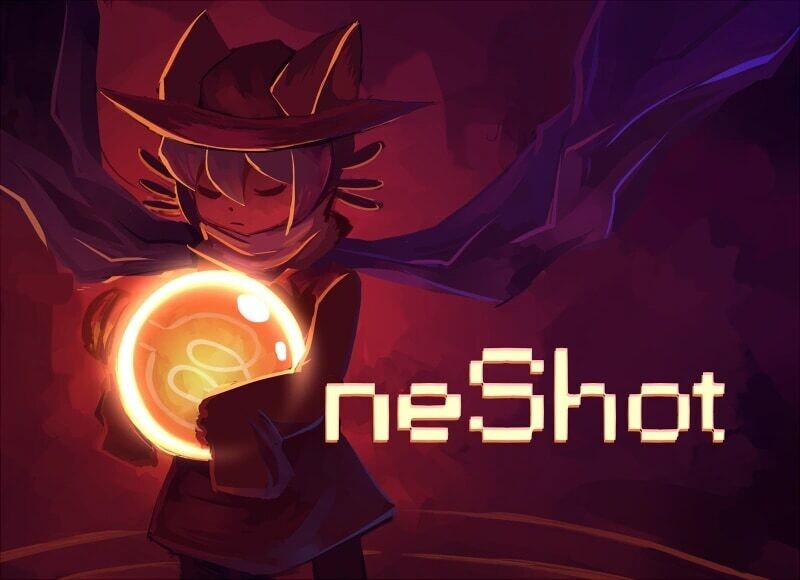

# OneShot: как инди-игра делает потерю игровой механикой

[DTF](https://dtf.ru/games/5056468-oneshot-kak-indi-igra-peredaet-emotsii-cherez-igrovuyu-mehaniku)

«…Of course, things are never that simple.
The world knows you exist.
The consequences are real.
Saving the world may be impossible.
You only have one shot»

## [начало]

Инди-игры независимых разработчиков интересны как минимум тем, что автор свободен в идее, которую он хочет реализовать. На него не давят инвесторы, политика и сроки, как в играх большего масштаба. В такой обстановке тихо рождаются шедевры, и OneShot как раз из таких игр. Эти релизы тише, чем релизы больших студий и порой они доходят до игрока спустя годы, но идеи, заложенные в них, круче потраченных бюджетов

Чем вообще короткая инди-игра в жанре puzzle/adventure может быть интересна?

Главный герой Нико просыпается в заброшенном жилище и находит в подвале лампочку. Выйдя на поверхность, он осознает, что попал в застывший после катастрофы мир, который медленно погибает. Солнце мира перестало светить, повсюду темнота, все люди эвакуировались, батареи разряжаются, на поверхности остались обесточенные роботы, и редкие жители, которые продолжают использовать батареи и фосфорных креветок в банках для освещения. Его встречают как мессию - того, кто должен донести эту лампочку до Башни и зажечь новое солнце. Игрок вместе с ним должен добраться туда, установить лампочку и вернуть Нико домой

Что здесь может быть цепляющим? На самом деле каждая деталь

## [об игре]

Главный герой Нико - маленький ребёнок, который случайно попал в этот мир и очень хочет домой. Он боится этого тёмного мира, он капризничает, плачет, хочет спать, порой не слушается игрока. Например, игра дальше не пойдет, если ты не найдешь ему постель и он не поспит. При этом Нико видит сны, говорит о них и после каждой ночи всё сильнее хочет домой

Первые жители планеты, которых встречает Нико - роботы. Все люди эвакуировались. Этим ходом игра прямо говорит, что все персонажи вокруг Нико - это NPC, роботы, программы. Первое время Нико ощущается единственным живым среди роботом. Все, кто встречают его и видят у него лампочку, обращаются к нему как к Мессии, та как этом мире есть пророчество, что однажды придет существо с лампочкой и снова зажжет солнце. А игрок, то есть ты - божество этого мира. С божеством может общаться только Мессия, поэтому Нико действительно общается с тобой. У Нико есть воспоминания, сны, собственные реакции, эмоции, порой он обращается к игроку, задает вопросы, комментирует ситуацию. Этим ходом игра показывает тебе, что Нико - живой персонаж, но при этом он под твоим управлением

Графика мира сделана в стиле pixel art и это идёт на пользу игре. Она наглядно показывает тебе, что этот мир маленький, уютный, ламповый и очень хрупкий. Мир почти истощен, он умирает, но там остались маленькие островки жизни. Это не руины, а остатки чьего-то дома. Графика показывает, что мир был живым и комфортным, поэтому его смерть выглядит не как катастрофа, а как тихое угасание. С масштаба игрока это все работает так, что ты не хочешь, чтобы этот маленький уязвимый мир умирал

Музыка в этом мире блестящая. Она не мешает, не отвлекает, а настраивает на нужную атмосферу. В каждой комнате она своя. Музыка подобрана так, что с переходами по миру меняется не просто музыка, но и твое внутреннее состояние

Самое главное - игра не просто так называется OneShot. У игрока есть всего одна попытка пройти эту. Эта концепция необратимости - главная фишка игры. Причем в ранних версиях игроку нельзя было выходить из игры вне зоны сохранений - иначе он больше не возвращался в игру. В свое время это очень сильно удивляло игроков и решалось только переустановкой игры. С 2016 года игра стала более отзывчивой к игроку, появились автоматические сохранения, но концепция одной попытки сохранилась до сих пор. OneShot показывает тебе, что выбор абсолютно необратим, чтобы ты переживал его как настоящий выбор

В идеале игрок стремится достичь Башни, зажечь лампочку вместо старого солнца и вернут Нико домой. Это счастливый конец. Но что, если по ходу игры не все условия были соблюдены и в конце тебе придётся решать: ты готов спасти мир, но предать Нико или ты согласен вернуть Никто домой, но предать этот мир?

## [приручение]

«— Я начинаю понимать, — сказал Маленький принц. — Есть одна роза... Наверно, она меня приручила…»

В игровых диалогах порой звучит тема приручения (taming). В мире игры роботы ограничены в своих действиях программой и многие из них прямо говорят, что это потому, что они так и не были приручены. Поэтому они могут только следовать своему алгоритму. Такие роботы даже в чрезвычайной ситуации не могут переопределить свою инструкцию

Но есть один способ, чтобы машина вышла за пределы ограничений программ, но не в результате ошибки, а как сознательный выбор - это приручение робота. Для прирученного робота ситуация, связь и доверие начинают значить больше чистой инструкции. То есть машина перестаёт быть только механизмом и становится субъектом. Как происходит приручение робота - об этом вы узнаете в игре

Что-то подобное происходит между Нико и игроком. Игра с самого начала говорит, что Нико - не аватар игрока. Нико - это отдельное существо. Он знает об игроке и относится к тебе не как к кнопкам управления, а как к присутствующему рядом существу. Порой он напрямую говорит с тобой, задаёт вопросы о тебе. Нико не просто ломает четвёртую стену, он живёт на её границе. Это создаёт эффект, что игрок не просто управляет им, а сопровождает его. Ты нажимаешь на стрелочки, а Нико доверяет выбранному направлению

Из-за такого поведения меняется привычное ощущение игры. У игрока есть не власть над персонажем, а ответственность за него. На это работает сам миф игры: Нико - это Мессия, а игрок - это бог игры. Только Мессия может общаться с богом, и только бог введет Мессию

Восхищает, что при таком маленьком мире создатели вложили в Нико столько ролей: он ребёнок, паломник, питомец и твой друг. Благодаря этому возникает эмоциональная связь, потому что ты не просто смотришь на историю Нико, ты помогаешь ему выживать и вернуться домой. Без тебя он не может пройти, но и ты без него не можешь завершить игру. Весь этот рецепт создаёт связь, после которой персонаж перестаёт быть функцией игры. Кажется, что сама игра была сделана только для одной сцены, ради одного опыта - если Нико для тебя реален, то финальный выбор тоже реален

Эту главу хочется закончить ремаркой о том, что интерактивные игры, в отличие от книг и фильмов, имеют свои уникальные инструменты вовлечённости. Читая книгу и смотря фильмы, ты, безусловно, сопереживаешь персонажу и становишься свидетелем действия, но только в игре ты - соучаствуешь в действии и ты в каком-то смысле сливаешься с самим персонажем. В игре сам игрок решает куда пойти, сколько времени пробыть в той или иной локации, какие действия совершить. В игре не просто персонаж что-то сделал - это ты сделал выбор и совершил действие его руками. В хороших играх действия и выбор становятся не просто темой произведения, а виной и ответственностью игрока. Эту сильную сторону видеоигр создатели OneShot понимали очень хорошо

При этом OneShot, благодаря настрою на одну попытку, избавилась от лишнего игрового багажа и стала больше произведением, чем просто игрой. Ведь в книге нельзя сохраниться перед главой. В мультфильме нельзя исправить увиденное. Самой игре это только пошло на пользу. - это дает более сильную эмоциональную связь

## [солнцестояние]

**SPOLER ALERT; SPOLER ALERT; SPOLER ALERT;**

**ВНИМАНИЕ**: текущая версия игры имеет дополнительный контент «Солнцестояние» (solstice). Советую читать дальше, только если вы прошли основную игру. В противном случае вы рискуете испортить впечатление от игры

**SPOLER ALERT; SPOLER ALERT; SPOLER ALERT;**

Надеюсь, что вы читаете дальше только после прохождения основной игры

В steam-версии игры, после прохождения основной части тебе открывается дополнение «Солнцестояние». Я считаю эту часть игры обязательной к прохождению, потому что это дополнение задаёт очень интересный и глубокий вопрос: а теперь посмотрим, что значит повторить попытку в мире, где попытка должна была быть только одна

Это самая эмоциональная часть приключения. Нико снова просыпается в том же помещении, в том же мире и находит ту же лампочку, но при этом он помнит первое прохождение. Из-за такого события, которое не должно было произойти, игра начинает распадаться. Часть привычной карты недоступна. Мир буквально разваливается на части. Тебе приходится идти другими маршрутами. Для маленького Нико начинается настоящий кошмар. Если раньше игра не спешно раскрывалась перед тобой, то теперь кажется, будто ты смотришь триллер. Игра накаляется. Музыка передаёт тебе напряжение. Мир игры ломается у тебя на глазах. Сюжет идет иначе и динамичнее. С каждой новой локацией риск умереть становится всё сильнее

Это прохождение воспринимается не как повтор, а как продолжение эксперимента. И тут возникает вопрос: сможешь ли ты в таком режиме выполнить все условия, спасти мир и вернуть Нико домой?

## [концепция одной попытки]

**SPOLER ALERT; SPOLER ALERT; SPOLER ALERT;**

**ВНИМАНИЕ**: советую читать дальше, только если вы прошли «Солнцестояние». В противном случае вы рискуете испортить впечатление от игры

**SPOLER ALERT; SPOLER ALERT; SPOLER ALERT;**

Надеюсь, что вы читаете дальше только после прохождения «Солнцестояние»

«Приручение — это когда настоящий человек беспокоится о тебе, верно?
Когда настоящий человек верит, что ты такой же настоящий, ведь так?
И знаешь что! Я верю!
И я знаю, что <игрок> тоже верит!
...хоть ты и сказала ему, что у него только одна попытка, он всё равно нашёл способ вернуться, верно?»
*OneShot*

Гениальный ход, который делает «Солнцестояние» - это сохранить концепцию одной попытки, несмотря на второй заход в игру. Да, у нас получилось спасти мир и вернуть Нико. Но если попробовать запустить игру заново, игра как будто прямым текстом говорит тебе: «Всё. Нико больше нет. Он вернулся к себе. У тебя была всего одна попытка и ты её использовал. Я могу запустить всё заново, но это будет уже не Нико. Это будет его аватар из воспоминаний, сохранённый отпечаток»

Ты запускаешь игру заново и видишь, что это так. Персонаж поменялся. Вроде тот же, но теперь это не Нико. Уже совершенно другой спрайт. Проходить второй раз можно, но это не имеет никакого смысла. Формально можно запустить игру и пройти историю заново, а эмоционально уже нет. Всё уже случилось. Ради этого ощущения, ради этой ситуации стоит пройти OneShot

Как же меня поразил этот ход. Как же я был удивлён, что у создателей это получилось. Я не ожидал, что у меня случится эмоциональный отклик на это. Я сразу вспомнил один случай из детства. Однажды мои родители взяли домой щенка. Обычный активный, шаловливый и глупый пёс. Я воспринимал его как должное - иногда играл с ним, иногда забивал на него, никогда не убирался за ним, порой любил, порой злился на него. За короткое время у нас он ужасно надоел моим родителям и они решили отдать его знакомым пока мы не успели сильно к нему привыкнуть. К такому действию я относился несерьёзно, как и к самому псу, и я был уверен, что в какой-то момент он вернётся. Я не осознавал, что же произошло, а понял это только после того, как пса не стало. Впервые я ощутил это запоздалое чувство, что чего-то нет и этого уже никогда не будет, от чего я впал в истерику. Потом у меня были другие домашние животные, но такой же привязанности - никогда. Если бы не OneShot, не знаю, чтобы еще могло вскрыть старый опыт необратимой потери. Это очень хорошо показывает что можно повторить действия заново, но нельзя повторить туже самую связь

Возвращаюсь к теме того, какой опыт дают видеоигры, хочется добавить, что проект OneShot мог быть хорошим мультфильмом или мультсериалом, но такого же эффекта эмоционального вовлечения не возникло бы. В конце игрок не прочитал книгу, не посмотрел фильм, не прошёл игру - он буквально проводил Нико и отпустил его

Здесь хочется сделать отсылку к Ролану Барту и сказать, что OneShot для меня была не игрой-удовольствием, а игрой-наслаждением. Так расшатать привычные устои и дать уникальный опыт может не каждая игра. Поэтому я люблю инди-разработку - за смелость и такие эксперименты, именно это «новое» способно поразить и потрясти сознание
